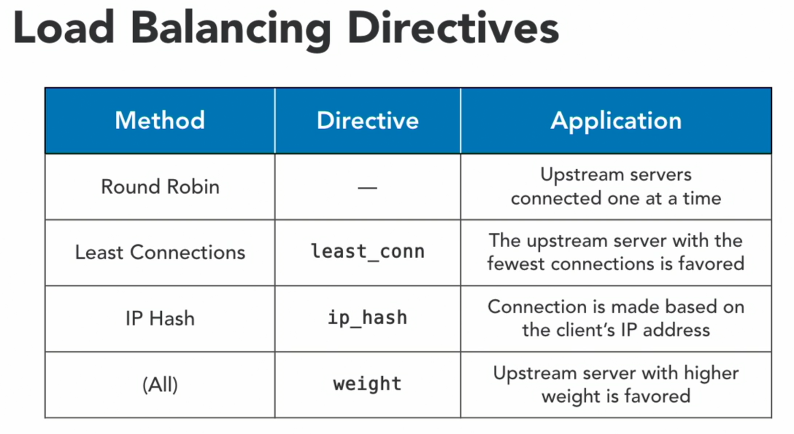
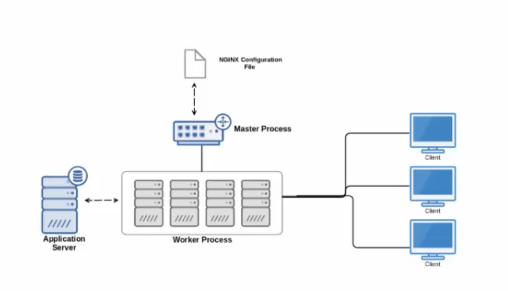
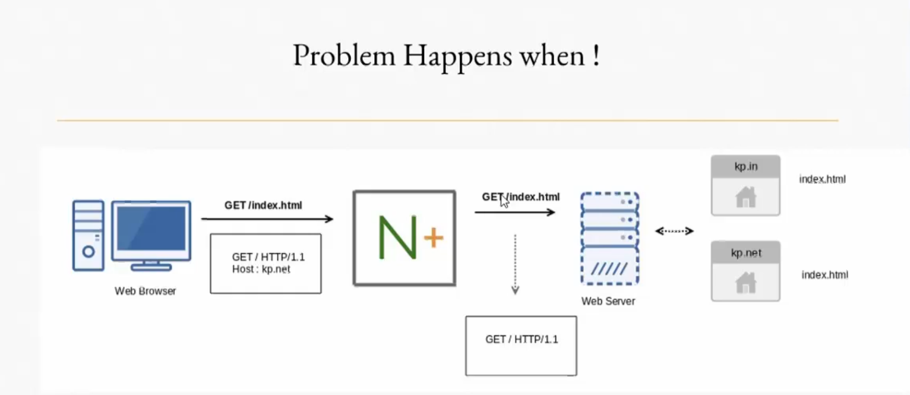
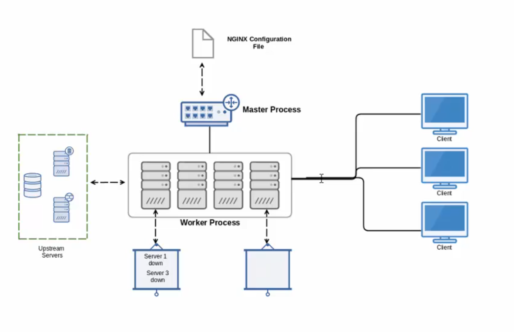
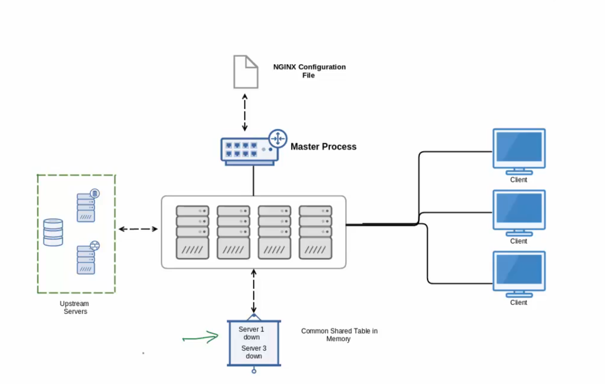
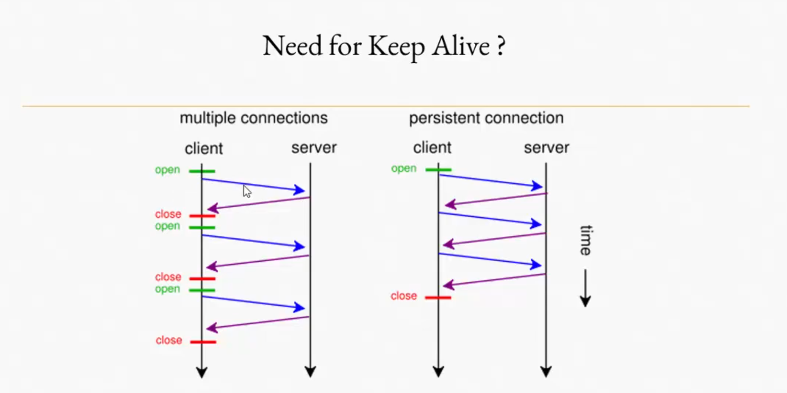
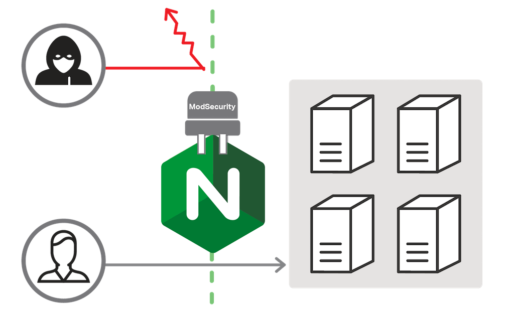

## - NGINX IN DEPTH (webserver, load balancer, reverse proxy, static-content, high performance, proxy)

    ## Config folders
    /etc/nginx
    /etc/nginx/conf.d
    /etc/nginx/sites-available
    /etc/nginx/sites-enabled
    ## Config file
    /etc/nginx/nginx.conf
    ## nginx Log:
    /var/log/nginx
    ## http-Root:
    /var/wwww/html

### + Setup Vagrant Ubuntu VM :

    $ vagrant init bento/ubuntu-16.04

    + Vagrant file :

    guest_ip = "192.168.0.3"

    Vagrant.configure("2") do |config|

        config.vm.box = "bento/ubuntu-16.04"
        config.vm.network "private_network", ip: guest_ip

        puts "---------------------------------------"
        puts "Demo URL : http://#{guest_ip}"
        puts "---------------------------------------"

    end

    $ vagrant up
    $ vagrant ssh

    #sudo su -
    #apt update
    #apt -y upgrade
    #apt install -y nginx
    #systemctl status nginx

    + Mean directories of nginx:
        -> /etc/nginx/sites-available # conf file
        -> /var/www/html # where there are websites pages content
        -> /var/log/nginx #log files

    + NGINX commands :
    - systemctl start nginx
    - systemctl stop nginx
    - systemctl is-active nginx
    - systemctl reload nginx
    - nginx -t # check configuration if it correct or not. before reloading it

    + Configuration For website `wisdompetmed.local.conf` :
    #default configuration
    - cd /etc/nginx/sites-enabled/
    - ls -ltr
        default -> /etc/nginx/sites-available/default

    ## Remove the default configuration
    unlink /etc/nginx/sites-enabled/default

    - vi /etc/nginx/conf.d/wisdompetmed.local.conf

        server {
            listen 80 default_server;
            server_name wisdompetmed.local www.wisdompetmed.local;
            index index.html index.htm index.php;
            root /var/www/wisdompetmed.local;
        }

    - nginx -t
    - systemctl reload nginx
    - mkdir /var/www/wisdompetmed.local
    - echo "hello world" > /var/www/wisdompetmed.local/index.html
    - systemctl status nginx

    - curl localhost

    # Copy files from Host to Vagrant Ubuntu
    $ vagrant plugin install vagrant-scp
    $ vagrant ssh-config
    $ scp -P 2202 -r static-website vagrant@127.0.0.1:./static-website
    $ password: vagrant
    #you should not be sudo user. else exit

    $ sudo apt install unzip
    $ ls /var/www/wisdompetmed.local
    $ unzip -o Wisdom_Pet_Medicine_responsive_website_LYNDA_12773.zip -d /var/www/wisdompetmed.local
    $ cd /var/www/wisdompetmed.local

    #secure files and folders make them readonly for world and write by root:
    $ sudo find /var/www/wisdompetmed.local -type f -exec chmod 644 {} \; # to secure the files
    $ sudo find /var/www/wisdompetmed.local -type d -exec chmod 755 {} \; # to secure the folders
    $ ls -ltr # check

    $ vi /etc/nginx/conf.d/wisdompetmed.local.conf

    #add
     server {
        [.....]

        location / {
            # First attempt to serve request as file, then
            # as directory, then fall back to displaying a 404.
            try_files $uri $uri/ =404;
        }

        location /image {
            # Allow the contents of the /image folder to be listed
            autoindex on;
        }

        error_page 404 /404.html;
        location = /404.html {
            internal;
        }

        error_page 500 502 503 504 /50x.html;
        location = /50x.html {
            internal;
        }

        location = /500 {
            # to test error 500 page
            fastcgi_pass unix:/this/will/fail;
        }

    }

    $ nginx -t
    $ systemctl reload nginx

    # now you can check the pages uri/images | uri/404 | uri/500

    #add logs files
    $ nginx -t
    $ systemctl reload nginx
    $ cd /var/log/nginx
    $ ls -ltr

    #requesting home page 10 times to valide logs
    $ for i in {1..10}; do curl localhost > /dev/null; done
    $ cat wisdompetmed.local.access.log

    $ for i in {1..10}; do curl localhost/images/ > /dev/null; done
    $ cat wisdompetmed.local.images.access.log

### - Troubleshooting nginx
    $ nginx -t # check config files are correct.
    $ sudo lsof -P -n -i :80 -i :443 | grep LISTEN # check port 80 for http and 443 for https are open.
    $ sudo netstat -plan | grep nginx # check processes that are listening.


### - NGINX WebserverSecurity :

    # best practices
    1- keep your OS and Software up-to-date to protect yourself from old vulnerabilities.
    2- restrict access where possible.
    3- use passwords to protect sensitive informations.
    4- use SSL to protect transmissions and identify your site.

    # limit access
    $ vi /etc/nginx/conf.d/wisdompetmed.local.conf
        location /images/ {
            deny all;
        }

    $ nginx -t
    $ systemctl reload nginx

    # you won't get the page.

    # update restricction

    location /images/ {
        allow 192.168.0.0/24;
        allow 10.0.0.0/8;
        deny all;
    }

    $ nginx -t
    $ systemctl reload nginx

    $ vagrant destroy name

### - Establish Authentification to access home page:

    ### Install apache-utils
    $ apt-get install -y apache2-utils

    ### Create a password file outside of root directory for securing locations

    $ htpasswd -b -c /etc/nginx/passwords admin #  -b -c for creating file
    $ chown www-data /etc/nginx/passwords # only be read by root and nginx user
    $ chmod 600 /etc/nginx/passwords

    $ ls -ltr /etc/nginx/passwords # check if permissions has been applied

    # if you want to change password of a user
    $ htpasswd -b -c /etc/nginx/passwords admin
    - deleting password
    - new password

    # add auth in the sectionyou want -> / or /images ..etc

    $ vi /etc/nginx/conf.d/wisdompetmed.local.conf

        location /images/ {
            # Allow the contents of the /image folder to be listed
            autoindex on;
            auth_basic "Authentication is required...";
            auth_basic_user_file /etc/nginx/passwords; # outside http-root for security reasons
            access_log /var/log/nginx/wisdompetmed.local.images.access.log;
            error_log /var/log/nginx/wisdompetmed.local.images.error.log;
            allow 192.168.0.0/24;
            allow 10.0.0.0/8;
            deny all;
        }

    $ nginx -t
    $ systemctl reload nginx


### - Configure HTTPS :

    # SSL vs TLS
    + SSL can be reversed and it's deprecated.
    + TLS is used for encrypting web traffic.

    $ apt install openssl
    $ openssl req -batch -x509 -nodes -days 365 -newkey rsa:2048 -keyout /etc/ssl/private/nginx.key -out /etc/ssl/certs/nginx.crt

    # req "request to openssl"
    # -batch "remove the prompts altogether"
    # -x509 "generete a x509 certificate"
    # -nodes "not use DES encryption method"
    # -days 365 "lenth of time this certificate is valid"
    #-newkey "to generate a new key"
    # rsa:2048 "use RSA encryption method 2048-bit key"
    # -keyout "path to store the key"
    # -out "path to the certificate tha openssl wil generate"

    $ ls -ltr /etc/ssl/certs/nginx.crt #check certificat

    $ vi /etc/nginx/conf.d/wisdompetmed.local.conf


        server {
            listen       443 ssl;
            server_name  localhost;

            ssl_certificate      /etc/ssl/certs/nginx.crt;
            ssl_certificate_key  /etc/ssl/private/nginx.key;

            ssl_session_cache    shared:SSL:1m;
            ssl_session_timeout  5m;

            ssl_ciphers  HIGH:!aNULL:!MD5;
            ssl_prefer_server_ciphers  on;

            location / {
                root   /etc/nginx/html/;
                index  index.html index.htm;
            }
           }

        }

    $ nginx -t
    $ systemctl reload nginx

### - Reverse Proxy & Load balancer :

    + Reverse proxy
    - middle man between client and server
    - could handle just one server
    - help implementing SSL, Logs, for web applications
    - compress data so that reduce latency of response.
    - cache data so it can reduce request to a server each time.

    + load balancer :
    - could do all reverse proxy functionnalities but with many servers.

    # Setup a Reverse Proxy

    $ unlink /etc/nginx/sites-enabled/default
    $ vim /etc/nginx/conf.d/upstream.conf

    $ nginx -t
    $ systemctl reload nginx



    # Setup a Loadbalancer

    # RUN THESE COMMANDS ON YOUR LOCAL WORKSTATION
    # Start the virtual machine and log in
    vagrant up
    vagrant ssh

    # Nginx is installed for you in this lesson.
    # Proceed with the following steps to complete the configuration.

    # RUN THESE COMMANDS ON THE VIRTUAL MACHINE
    sudo su -

    # Remove the default configuration
    unlink /etc/nginx/sites-enabled/default

    # Create a the new configuration
    vim /etc/nginx/conf.d/upstream.conf

    # Add the following contents to /etc/nginx/conf.d/upstream.conf:
    upstream app_server_7001 {
        server 127.0.0.1:7001;
    }

    upstream roundrobin {
        # default is round robin
        server 127.0.0.1:7001;
        server 127.0.0.1:7002;
        server 127.0.0.1:7003;
    }

    upstream leastconn {
        # The server with the fewest connections will get traffic
        # if we have two servers one take 1 sec and other take 20sec we will go each time for 1 sec server.
        least_conn;
        server 127.0.0.1:7001;
        server 127.0.0.1:7002;
        server 127.0.0.1:7003;
    }

    upstream iphash {
        # Connections will stick to the same server
        ip_hash;
        server 127.0.0.1:7001;
        server 127.0.0.1:7002;
        server 127.0.0.1:7003;
    }

    upstream weighted {
        # More connections will be sent to the weighted server
        server 127.0.0.1:7001 weight=2;
        server 127.0.0.1:7002;
        server 127.0.0.1:7003;
    }

    server {
        listen 80;

        location /proxy {
            # Trailing slash is key!
            proxy_pass http://app_server_7001/;
        }

        location /roundrobin {
            proxy_pass http://roundrobin/;
        }

        location /leastconn {
            proxy_pass http://leastconn/;
        }

        location /iphash {
            proxy_pass http://iphash/;
        }

        location /weighted {
            proxy_pass http://weighted/;
        }
    }

    # Test and reload the configuration
        nginx -t
        systemctl reload nginx

    ## Test and reload the configuration
    nginx -t
    systemctl reload nginx

    ## cat start_app_servers.py
    ```
    #!/usr/bin/env python3
    '''Module: Starts three HTTP servers'''
    import os
    import time
    from http.server import BaseHTTPRequestHandler, HTTPServer
    from pprint import pprint

    hostName = "localhost"

    class MyServer(BaseHTTPRequestHandler):
        def do_GET(self):
            #print(self.server)
            #print(self.headers)
            self.send_response(200)
            self.send_header("Content-type", "text/html")
            self.end_headers()
            self.wfile.write(bytes("""
            <!DOCTYPE html>
            <html>
                <head>
                    <style> h1 {
                                font-size:100px;
                                text-align:center;
                                margin-left:auto;
                                margin-right:auto
                               }
                            p {
                                font-size:20px;
                                text-align:center;
                              }
                    </style>
                    <title>%s</title>
                </head>
            <body>""" % self.headers['Host'] , "utf-8"))
            self.wfile.write(bytes("<h1>{}</h1>".format(self.request.getsockname()[1]), "utf-8"))
            self.wfile.write(bytes("<h1>{}</h1>".format(time.strftime('%X')), "utf-8"))
            self.wfile.write(bytes("</body></html>", "utf-8"))

    def start_server(port):
        this_server = HTTPServer((hostName, port), MyServer)
        print(time.strftime('%X'), "App server started - http://%s:%s" % (hostName, port))

        try:
            this_server.serve_forever()
        except KeyboardInterrupt:
            pass

        this_server.server_close()
        print(time.strftime('%X'), "App server stopped - http://%s:%s" % (hostName, port))

    # list of the ports the servers will listen on
    PORTS = [7001, 7002, 7003]

    # list to hold the PIDs from the forked servers
    SERVERS = []

    # start a fork for each port
    for port in PORTS:
        pid = os.fork()

        if pid:
            SERVERS.append(pid)
        else:
            start_server(port)
            exit(0)

    # wait for the servers to finish, bailing out on CTRL+C
    for server in SERVERS:
        try:
            os.waitpid(server, 0)
        except KeyboardInterrupt:
            exit(0)

    ```
    ## Start the app servers
    /usr/bin/python3  start_app_servers.py &

    ## Open each proxy location in a browser:
        http://192.168.0.3/roundrobin
        http://192.168.0.3/leastconn
        http://192.168.0.3/iphash
        http://192.168.0.3/weighted

    # troubleshooting problem - Address already in use:
    $ ps -fA | grep python
    $ kill 81651

### - Improve performance
    + Enable HTTP/2

    HTTP/2 allows browsers to request files in parallel, greatly improving the speed of delivery.
    You’ll need HTTPS enabled. Edit your browser configuration file, adding http2 to the listen directive,
    then restart NGINX:
        server {
           listen 443 http2 default_server;
           listen [::]:443 http2 default_server;
           #... all other content
        }

    + Enable gzip compression

    gzip compression can greatly decrease the size of files during transmission (sometimes by over 80%).
    Add the following to your server block:
        server {
           #...previous content
           gzip on;
           gzip_types application/javascript image/* text/css;
           gunzip on;
        }

    This will ensure that javascript files, images, and CSS files are always compressed.

    Warning:
    A security vulnerability exists when you enable gzip compression in conjunction with HTTPS that allows
    attackers to decrypt data. For static websites that don’t serve users sensitive data, this is less of an issue,
    but for any site serving sensitive information you should disable compression for those resources.

    + Enable client-side caching
    Some files don’t ever change, or change rarely, so there’s no need to have users re-download the latest version.
    You can set cache control headers to provide hints to browsers to let them know what files they shouldn’t request again.

        server {
           #...after the location / block
           location ~* \.(jpg|jpeg|png|gif|ico)$ {
               expires 30d;
            }
            location ~* \.(css|js)$ {
               expires 7d;
            }
        }

    Examine how frequently your various file types change, and then set them to expire at appropriate times.
    If .css and .js files change regularly, you should set the expiration to be shorter. If image files like .jpg never
    change, you can set them to expire months from now.

    + Dynamically route subdomains to folders
    If you have subdomains, chances are you don’t want to have to route every subdomain to the right folder.
    It’s a maintenance pain. Instead, create a wildcard server block for it, routing to the folder that matches the name:

        server {
               server_name ~^(www\.)(?<subdomain>.+).jgefroh.com$ ;
               root /var/www/jgefroh.com/$subdomain;
        }
        server {
                server_name ~^(?<subdomain>.+).jgefroh.com$ ;
                root /var/www/jgefroh.com/$subdomain;
        }

    Restart nginx, and you’ll automatically route subdomains to the same-named subfolder.

### - CentOS Nginx :
    $ rpm -qa | grep nginx # check weather nginx exist in your machine
    $ rpm -qa | grep epel-release # check weather epel-realease exist in your machine
    $ yum install epel-release
    $ yum install nginx

    $ cd /etc/nginx
    $ systemctl start nginx



    $ ps -ef --forest | grep nginx
    # this command will help you figure out the master process and how many workers there are configured.

    # nginx.conf in depth
    $ vi nginx.conf

        user nginx;
        worker_processes auto; # option auto give you 2 workers by default

        -> worker_processes 4;
        $ nginx -t
        $ systemctl reload nginx
        $ ps -ef --forest | grep nginx
            -> now there is 4 workers.

        #this directive means that one worker handle 1024 request
        events {
            worker_connections 1024;
        }

    # you can create a file a put into instructions and import it to have an organized files
    $ include ...

    #html files served in the front of webserver
    # ls /usr/share/nginx/html

    NOTE
    + Every important file used by nginx server you will find it in nginx.conf file

    # Configure our own nginx webserver
    $ cd /etc/nginx/conf.d
    $ touch web.conf
        server {
           server_name example.com www.example.com;

           location / {
             root /var/www/example;
             index index.html;
           }
        }

    $ nginx -t
    $ systemctl reload nginx
    $ mkdir /var/www/example
    $ echo "this is my first nginx webserver." > index.html
    # allow nginx to read files in this folder
    # check workers user by running vi nginx.conf -> user www-data
    $ sudo chown -R www-data /var/www/example

# Config a Reverse Proxy :


    ```
        webserver ip 192.168.0.4
        reverse_proxy ip 192.168.0.5
    ```


    #create another vagrant ubuntu machine and setup softwares on it.
    vagrant up
    vagrant ssh


    $ cd /etc/nginx/conf.d
    $ vi web.conf
    # basic reverse_proxy example :

        server {
            server_name _;

            location / {
                  proxy_pass http://192.168.0.4;
            }
        }

    $ cd /etc/nginx/sites-available
    $ rm -rf default.conf
    $ cd /etc/nginx/sites-enabled
    $ unlink default
    $ nginx -t
    $ systemctl reload nginx

    client : browser
    reverse_proxy : http://192.168.0.5/ forward -> http://192.168.0.4

    #check logs
    $ cd /var/log/nginx
    $ tail -f access.log

### - Reverse Proxy - X-Real-IP problem :


    + the problem here is that requests handled by the server come from one ip
      is the the reverse proxy ip


    + The solution should be to allow requests from the real ip

    - Solution
    # go to reverse-proxy server
    $ cd /etc/nginx/conf.d

        server {
            server_name _;

            location / {
                  proxy_pass http://192.168.0.4;
            ->    proxy_set_header X-Real-IP $remote_addr;
            }
        }


    $ nginx -t
    $ systemctl reload nginx

    # go to webserver
    #check logs
    $ cd /var/log/nginx
    $ tail -f access.log

        192.168.0.1 - - [19/May/2020:07:13:47 +0000] "GET / HTTP/1.1" 304 0 "-" "Mozilla/5.0 (Macintosh; Intel Mac OS X 10_13_6) AppleWebKit/537.36 (KHTML, like Gecko) Chrome/81.0.4044.138 Safari/537.36"
        # 192.168.0.1 is not the ip of reverse-proxy but it 's the real ip of the host.


### - Reverse Proxy - Proxy Host Header problem :



    + the problem here is that the server want to get the hostname not just the resource requested.
    # one hostname
    -> Get index.html   X

    # multiple hostnames
    -> Get blog.mdrahali.com/index.html   -> "my name is Mohamed El RAhali"   V
    -> Get stack.mdrahali.com/index.html   -> "hello world"   V

    + if we have multiple hostname for multiple purpose, it's an obligation to forward hostname
      to help webserver figure out what to respond

    NB : if we have one hostname, its not important to config this feature.


    #go to webserver

    $ cd /var/www/example
    $ mkdir example.com
    $ mkdir example.net
    $ cd example.com
    $ echo "this is my first nginx webserver." > index.html
    $ cd ..
    $ cd example.net
    $ echo "hello world" > index.html

    $ cd /etc/nginx/conf.d
    $ vi web.conf

        server {
           server_name mdrahali.com;

           location / {
             root /var/www/example/mdrahali.com;
             index index.html;
           }
        }

        server {
           server_name mdrahali.net;

           location / {
             root /var/www/example/mdrahali.net;
             index index.html;
           }
        }


    $ nginx -t
    $ systemctl reload nginx


    $ cd /etc/nginx/conf.d
    $ vi web.conf

        server {
            server_name _;

            location / {
                  proxy_pass http://192.168.0.4;
            ->    proxy_set_header Host $host;
            }
        }

    $ sudo chown -R www-data /var/www/example
    $ sudo chown -R www-data mdrahali.com/
    $ sudo chown -R www-data mdrahali.net/

    $ nginx -t
    $ systemctl reload nginx

    $ For testing and accepting doing a "catch-all", you can use server_name _ .

    $ cd /etc
    $ vi hosts
    #add this
    $ 127.0.0.1 locahost www.mdrahali.com mdrahali.com www.mdrahali.net mdrahali.net

    $ curl mdrahali.com
    $ curl mdrahali.net

    $ cd /var/log/nginx
    $ tail -f access.log
    This directive is available as part of nginx commercial subscription.

### - Loadbalancer :

    + prerequisites - Vagrant VM:

        1- server-1 -> 192.168.0.6
        2- server-2 -> 192.168.0.4
        3- load-balancer -> 192.168.0.5

    1- server-1 -> 192.168.0.6
    $ cd /var/www/
    $ mkdir example
    $ cd example && echo "server 1" > index.html
    $ cd /etc/nginx/conf.d
    $ vi web.conf
        server {
           server_name _;

           location / {
             root /var/www/example/;
             index index.html;
           }
        }

    $ nginx -t
    $ systemctl reload nginx
    $ curl localhost
        -> server 1

    2- server-2 -> 192.168.0.4
    $ cd /var/www/
    $ mkdir example
    $ cd example && echo "server 2" > index.html
    $ cd /etc/nginx/conf.d
    $ vi web.conf
        server {
           server_name _;

           location / {
             root /var/www/example/;
             index index.html;
           }
        }

    $ nginx -t
    $ systemctl reload nginx
    $ curl localhost
        -> server 2

    3- load-balancer -> 192.168.0.5
    $ cd /etc/nginx/conf.d
    $ vi web.conf
        upstream backend {
            server 192.168.0.4;
            server 192.168.0.6;
            zone backend 64k;
        }

        server {
                server_name mdrahali.com;
                listen 80;
                location / {
                      proxy_pass http://backend;
                      #health_check interval=10 fails=3 passes=2;
               }
        }

    NOTE
    -> `health_check` directive is available as part of nginx commercial subscription.
    -> it ping servers each time with an interval to see if server is down/up.

    # load balancing method implemented here is Round Robin. each server sequentially.

    1- first scenario
    - imagine 2 servers are down, 1 server is up and worker 3 requesting each server to respond to a request
      he will mark server 1,2 as down and get respond from server 3 and serve the client.
      the same scenario will repeat with other workers because each worker has it's own memory



    + this is why nginx have a mechanism to configure a shared-memory to optimize this process.
    -> zone backend 64k



    ++ The zone directive defines a memory zone that is shared among worker processes
       and is used to store the configuration of the server group. This enables the worker
       processes to use the same set of counters to keep track of responses from the servers
       in the group. The zone directive also makes the group dynamically configurable.

       - 64k :
        Setting the Size for the Zone
        There are no exact settings due to quite different usage patterns. Each feature,
        such as sticky cookie/route/learn load balancing, health checks, or re-resolving
        will affect the zone size.

        - For example, the 256 Kb zone with the sticky_route session persistence method and a single health check can hold up to:

            128 servers (adding a single peer by specifying IP:port);
            88 servers (adding a single peer by specifying hostname:port, hostname resolves to single IP);
            12 servers (adding multiple peers by specifying hostname:port, hostname resolves to many IPs).


    # Testing :

    ## Open each proxy location in a browser:
        http://192.168.0.5/roundrobin
        http://192.168.0.5/leastconn
        http://192.168.0.5/iphash
        http://192.168.0.5/weighted

    ## also you can test in terminal
    $ curl mdrahali.com/roundrobin
    $ curl mdrahali.com/leastconn
    $ curl mdrahali.com/iphash
    $ curl mdrahali.com/weighted


### - Health monitoring - active & passive :

    + tip 1 -  i can mark a server as down by :
        upstream backend {
            server 192.168.0.4 down;
            server 192.168.0.6;
            zone backend 64k;
        }

    + tip 2 - passive monitoring :

         upstream backend {
            server 192.168.0.4 max_fails=3 fail_timeout=50;
            server 192.168.0.6;
            zone backend 64k;
        }

        # go to server 1
        $ systemctl stop nginx

        # go to load balancer
        # for i in {1..3}; do curl mdrahali.com

        # go to server 1
        $ systemctl start nginx

        # go to load balancer
        $ curl mdrahali.com
        # you will observe that load-balancer won't request server 1 because he considere it as down fro 50s.

    max_fails=number
    sets the number of unsuccessful attempts to communicate with the server that should happen
    in the duration set by the fail_timeout parameter to consider the server unavailable for a
    duration also set by the fail_timeout parameter. By default, the number of unsuccessful attempts is set to 1.

    fail_timeout=time
    sets
    the time during which the specified number of unsuccessful attempts to communicate with the server
    should happen to consider the server unavailable;
    and the period of time the server will be considered unavailable.
    By default, the parameter is set to 10 seconds.

    + for more options in load-balancers -> http://nginx.org/en/docs/http/ngx_http_upstream_module.html


    + tip 3 - active monitoring :

    + health_check directive:
    interval – How often (in seconds) NGINX Plus sends health check requests (default is 5 seconds)
    passes – Number of consecutive health checks the server must respond to to be considered healthy (default is 1)
    fails – Number of consecutive health checks the server must fail to respond to to be considered unhealthy (default is 1)

    server {
        listen       80;
        proxy_pass   backend;
        health_check interval=10 passes=2 fails=3;
    }


### - Cache Header Control :

    # go to webserver

    $ vagrant ssh-config
    $ vagrant ssh

    # go to a new tab ./nginx-server

    $ cd static
    $ scp -P 2201 -r loadbalancer.png vagrant@127.0.0.1:.

    # go to webserver

    $ sudo mv loadbalancer.png /var/www/example
    $ cd /var/www/example && echo "hello world" > demo.txt
    $ sudo su -
    $ cd /etc/nginx/conf.d/
    $ vi web.conf

        server {
           server_name _;

           location / {
             root /var/www/example/;
             index index.html;
           }

         location ~ \.(png) {
             root /var/www/example/;
             add_header Cache-Control max-age=120;
             # this header means that the server will cache the png files for 120 sec. and delete it.
           }

         location ~ \.(txt) {
             root /var/www/example/;
             expires -1;
             # expires -1 means don't cache this resource, there is others options : expires 48h; expires 1d; expires 2w; ..etc
           }
        }

    $ nginx -t
    $ systemctl reload nginx
    $ curl -I http://192.168.0.6/loadbalancer.png

        HTTP/1.1 200 OK
        Server: nginx/1.10.3 (Ubuntu)
        Date: Wed, 20 May 2020 03:57:19 GMT
        Content-Type: image/png
        Content-Length: 891061
        Last-Modified: Wed, 20 May 2020 03:42:33 GMT
        Connection: keep-alive
        ETag: "5ec4a729-d98b5"
        Cache-Control: max-age=120
        Accept-Ranges: bytes

    $ curl -I http://192.168.0.6/demo.txt
        HTTP/1.1 200 OK
        Server: nginx/1.10.3 (Ubuntu)
        Date: Wed, 20 May 2020 03:58:00 GMT
        Content-Type: text/plain
        Content-Length: 15
        Last-Modified: Wed, 20 May 2020 03:45:14 GMT
        Connection: keep-alive
        ETag: "5ec4a7ca-f"
        Expires: Wed, 20 May 2020 03:57:59 GMT
        Cache-Control: no-cache
        Accept-Ranges: bytes

        location ~* \.(js|css|png|jpg|jpeg|gif|ico)$ {
            expires 2d;
            add_header Cache-Control "public, no-transform";
        }

### + Other Cache directive :

    - Cache-Control directives#
      The following is a list of the common directives used and configured when using the Cache-Control header.
      See HTTP/1.1 section 14.9 for a further explanation of the directives available.

        Cache-Control: no-cache#
        no-cache uses the ETag header to tell caches that this resource cannot be reused without first checking
        if the resource has changed on the origin server. This means that no-cache will make a trip back to
        the server to ensure the response has not changed and therefore is not required to download the
        resource if that is the case.

        Cache-Control: no-store#
        no-store is similar to no-cache in that the response cannot be cached and re-used, however there is
        one important difference. no-store requires the resource to be requested and downloaded from the
        origin server each time. This is an important feature when dealing with private information.

        Cache-Control: public#
        A response containing the public directive signifies that it is allowed to be cached by any
        intermediate cache. This however is usually not included in responses as other directives already
        signify if the response can be cached (e.g max-age).

        Cache-Control: private#
        The private directive signifies that the response can only be cached by the browser that is accessing the file.
        This disallows any intermediate caches to store the response.

        Cache-Control: max-age=<seconds>#
        This directive tells the browser or intermediary cache how long the response can be used from the time it was requested.
        A max-age of 3600 means that the response can be used for the next 60 minutes before it needs to fetch a new response from the origin server.

        Cache-Control: s-maxage=<seconds>#
        s-maxage is similar to the above mentioned max-age however the "s" stands for shared and is relevant only to CDNs or other intermediary caches.
        This directive overrides the max-age and expires header.

        Cache-Control: no-transform#
        Intermediate proxies sometimes change the format of your images and files in order to improve performance. The no-transform directive
        tells the intermediate proxies not to alter the format or your resources.


### - Connections persistence | Keep Alive :



    + The first parameter sets a timeout during which a keep-alive client connection will stay open on the server side.
      The zero value disables keep-alive client connections.

    # keepalive connection with resources in this directory / for 65 sec :
        location / {
             root /var/www/example/;
             index index.html;
             keepalive_timeout 65;
           }

    $ nginx -t
    $ systemctl reload nginx
    $ curl -I http://192.168.0.6/

        HTTP/1.1 200 OK
        Server: nginx/1.10.3 (Ubuntu)
        Date: Wed, 20 May 2020 04:21:56 GMT
        Content-Type: text/html
        Content-Length: 9
        Last-Modified: Tue, 19 May 2020 09:13:39 GMT
        Connection: keep-alive
        ETag: "5ec3a343-9"
        Accept-Ranges: bytes


### - Limit_Rate | download :

    # webserver 1 - 192.168.0.6
    $ webserver 2

    # webserver 2
    # download this resource from webserver
    + wget http://192.168.0.6/loadbalancer.png

        2020-05-20 04:36:56 (241 MB/s) - ‘loadbalancer.png’ saved [891061/891061]

    - download bandwidth 241 MB/s

    # webserver 1
    $ cd /etc/nginx/conf.d#

        location ~ \.(png) {
             root /var/www/example/;
             add_header Cache-Control max-age=120;
             limit_rate 50k;
           }

    $ nginx -t
    $ systemctl reload nginx

    # go to webserver 2
    + wget http://192.168.0.6/loadbalancer.png
        2020-05-20 04:46:26 (51.0 KB/s) - ‘loadbalancer.png’ saved [891061/891061]

    -> from 241 MB/s to 51.0 KB/s.

### - Limit_Conn :

    + Limiting the Request Rate
    Rate limiting can be used to prevent DDoS attacks, or prevent upstream servers from being overwhelmed by too many requests at the same time.
    The method is based on the leaky bucket algorithm: requests arrive at the bucket at various rates and leave the bucket at fixed rate.

    Before using rate limiting, you will need to configure global parameters of the “leaky bucket”:

    key - a parameter used to differentiate one client from another, generally a variable
    shared memory zone - the name and size of the zone that keeps states of these keys (the “leaky bucket”)
    rate - the request rate limit specified in requests per second (r/s) or requests per minute (r/m)
    (“leaky bucket draining”). Requests per minute are used to specify a rate less than one request per second.

    # webserver 1
    $ vi web.conf
        add this -> limit_conn_zone $binary_remote_addr zone=addr:10m;


    $ nginx -t
    $ systemctl reload nginx

    # go to server 2
    $ wget http://192.168.0.6/loadbalancer.png

    # go to server 3
    $ this service is temporarily unavailable.


### - GeoIP :
    + this technique is useful when you have for example DDOS attacks from one country/city you can block all ips of this country/city.


    # go to webserver
    # Setup GeoIP

    # downlaod GeoIP Country from :

    -> https://www.maxmind.com/en/accounts/312431/geoip/downloads
    $ scp -P 2201 -r GeoLite2-Country.tar.gz vagrant@127.0.0.1:.
    $ mkdir /etc/nginx/geoip
    $ sudo mv GeoLite2-Country.tar.gz /etc/nginx/geoip
    $ cd /etc/nginx/geoip
    $ tar -zxvf GeoLite2-Country.tar.gz
    $ mv GeoLite2-Country_20200519/ geoip_country/


    #Add a Hostname to the webserver :
    $ cd /etc
    $ vi hosts
        -> 127.0.0.1       localhost       mdrahali.com

    $ cd /etc/nginx/
    $ vi nginx.conf
    # add this line in http directive :
      -> geoip_country /usr/share/GeoIP/GeoIP.dat; # the country IP database
         map "$host:$geoip_country_code" $deny_by_country {
            ~^mdrahali.com:(?!MA) 1;
            default 0;
        }
    $systemctl restart nginx
    :MA for morocco if you want code for other countries check this website https://www.nirsoft.net/countryip/

    $ nginx -t
    $ systemctl reload nginx

    $ cd /etc/nginx/conf.d
    $ vi web.conf
        if ($deny_by_country) { return 403; }

    $ nginx -t
    $ systemctl reload nginx

    # Testing GeoIP blocking
    $ curl mdrahali.com
        <html>
            <head><title>403 Forbidden</title></head>
                <body bgcolor="white">
                    <center><h1>403 Forbidden</h1></center>
                <hr><center>nginx/1.10.3 (Ubuntu)</center>
            </body>
        </html>

    # Test on iP ADDRESSES :
    $ sudo apt-get install mmdb-bin
    $ apt-get install libmaxminddb-dev
    $ mmdblookup --file /etc/nginx/geoip/geoip_country/GeoLite2-Country.mmdb --ip 192.168.0.6

    https://dev.maxmind.com/geoip/legacy/codes/iso3166/


    # Other Example :
    $ vi nginx.conf
     #GeoIP
      geoip_country /usr/share/GeoIP/GeoIP.dat;
      map $geoip_country_code $allow_visit {
                default yes;
                MA no;
       }

    $ cd conf.d
    $ vi web.conf
        if ($allow_visit = no) {
                return 403;
           }

    + more example  -> https://docs.nginx.com/nginx/admin-guide/security-controls/controlling-access-by-geoip/


### - Logging :

    $ vi nginx.conf
    # add this two statements :

    ->  log_format master '$remote_addr - $remote_user [$time_local] '
                               '"$request" $status $body_bytes_sent '
                               '"$http_referer" "$http_user_agent" "$gzip_ratio"';

    # add just master to the path
    ->  access_log /var/log/nginx/access.log master;

    $ cd conf.d
    $ vi web.conf
    #add this -> access_log /var/log/nginx/example.log;

    $ systemctl reload nginx

    $ cd /var/log/nginx
    $ cat example.log
        127.0.0.1 - - [20/May/2020:07:19:16 +0000] "GET / HTTP/1.1" 200 9 "-" "curl/7.47.0"
        127.0.0.1 - - [20/May/2020:07:19:17 +0000] "GET / HTTP/1.1" 200 9 "-" "curl/7.47.0"
        127.0.0.1 - - [20/May/2020:07:19:18 +0000] "GET / HTTP/1.1" 200 9 "-" "curl/7.47.0"

### - Compression :

    + Compression is a great way to reduce the amount of packets to send to client requesting a resource
      Compression Algorithms could reduce data sent to users by 70% to it enhance speed alot.

    $ vi demo.txt
    $ ls -lh
    $ gzip -9 -c demo.txt > demo.gz
    $ ls -lh

        -rw-rw-r-- 1 vagrant vagrant 2.1K May 20 07:31 demo.gz
        -rw-rw-r-- 1 vagrant vagrant 5.3K May 20 07:31 demo.txt

    - 65% reducing size of data.

    #Add Compression to the server:
    $ vi nginx.conf
        gzip on;
        -> gzip_types text/plain text/css application/json application/javascript text/xml application/xml application/xml+rss text/javascript;
        gzip_disable "msie6";

    $ systemctl reload nginx

    $ cd /var/www/example
    $ vi demo.txt
    #add alot of text

    $ curl mdrahali.com/demo.txt > c1.txt
    $ curl -H "Accept-Encoding: gzip" mdrahali.com/demo.txt > c2.txt
    $ ls -lh
    #check sizes of each file.

    # level of compression :

    $ vi nginx.conf
    # add -> gzip_comp_level 9;

    + The level of gzip compression simply determines how compressed the data is on a scale from 1-9,
      where 9 is the most compressed. The trade-off is that the most compressed data usually requires
      the most work to compress/decompress, so if you have it set fairly high on a high-volume website,
      you may feel its effect.

### - Hotlink protection in Nginx

    Hotlinked files can be a major cause for bandwidth leeching for some sites. Here’s how you can hotlink protect
    your images and other file types using a simple location directive in your Nginx configuration file :

    location ~ \.(jpe?g|png|gif)$ {
         valid_referers none blocked mysite.com *.mysite.com;
         if ($invalid_referer) {
            return   403;
        }
    }

    Use the pipe (“|”) to separate file extensions you want to hotlink protect.

    The valid_referers directive contains the list of site for whom hotlinking is allowed. Here is an explanation
    of the parameters for the valid_referers directive :

    none - Matches the requests with no Referrer header.
    blocked - Matches the requests with blocked Referrer header.
    *.mydomain.com - Matches all the sub domains of mydomain.com. Since v0.5.33, * wildcards can be used in the server names.

### - Nginx Firewall :



    + nginx -V check modules of nginx

    -> Setup NAXSI

    Step 1 — Install NGINX && NAXSI

    $ wget http://nginx.org/download/nginx-1.14.0.tar.gz
    $ wget https://github.com/nbs-system/naxsi/archive/0.56.tar.gz -O naxsi
    $ tar -xvf nginx-1.14.0.tar.gz
    $ tar -xvf naxsi
    $ cd nginx-1.14.0
    $ sudo apt-get update
    $ sudo apt-get install build-essential libpcre3-dev libssl-dev
    $ ./configure \
        --conf-path=/etc/nginx/nginx.conf \
        --add-module=../naxsi-0.56/naxsi_src/ \
        --error-log-path=/var/log/nginx/error.log \
        --http-client-body-temp-path=/var/lib/nginx/body \
        --http-fastcgi-temp-path=/var/lib/nginx/fastcgi \
        --http-log-path=/var/log/nginx/access.log \
        --http-proxy-temp-path=/var/lib/nginx/proxy \
        --lock-path=/var/lock/nginx.lock \
        --pid-path=/var/run/nginx.pid \
        --user=www-data \
        --group=www-data \
        --with-http_ssl_module \
        --without-mail_pop3_module \
        --without-mail_smtp_module \
        --without-mail_imap_module \
        --without-http_uwsgi_module \
        --without-http_scgi_module \
        --prefix=/usr

    $ make
    $ sudo make install

    Step 2 — Configuring NAXSI

    $ sudo cp ~/naxsi-0.56/naxsi_config/naxsi_core.rules /etc/nginx/
    $ sudo vi /etc/nginx/naxsi.rules
         SecRulesEnabled;
         DeniedUrl "/error.html";

         ## Check for all the rules
         CheckRule "$SQL >= 8" BLOCK;
         CheckRule "$RFI >= 8" BLOCK;
         CheckRule "$TRAVERSAL >= 4" BLOCK;
         CheckRule "$EVADE >= 4" BLOCK;
         CheckRule "$XSS >= 8" BLOCK;
    $ mkdir /usr/html/
    $ sudo vi /usr/html/error.html
        <html>
          <head>
            <title>Blocked By NAXSI</title>
          </head>
          <body>
            <div style="text-align: center">
              <h1>Malicious Request</h1>
              <hr>
              <p>This Request Has Been Blocked By NAXSI.</p>
            </div>
          </body>
        </html>
    $ sudo vi /etc/nginx/nginx.conf
        http {
            include       mime.types;
            -> include /etc/nginx/naxsi_core.rules;
            include /etc/nginx/conf.d/*.conf;
            include /etc/nginx/sites-enabled/*;

        location / {
        include /etc/nginx/naxsi.rules;
            root   html;
            index  index.html index.htm;
        }

    Step 3 — Creating the Startup Script for Nginx

    $ sudo vi /lib/systemd/system/nginx.service
        [Unit]
        Description=The NGINX HTTP and reverse proxy server
        After=syslog.target network.target remote-fs.target nss-lookup.target

        [Service]
        Type=forking
        PIDFile=/run/nginx.pid
        ExecStartPre=/usr/sbin/nginx -t
        ExecStart=/usr/sbin/nginx
        ExecReload=/usr/sbin/nginx -s reload
        ExecStop=/bin/kill -s QUIT $MAINPID
        PrivateTmp=true

        [Install]
        WantedBy=multi-user.target

    $ sudo mkdir -p /var/lib/nginx/body
    $ sudo systemctl start nginx

    Step 4 — Testing NAXSI
    $ curl 'http://192.168.0.4/?q="><script>alert(0)</script>'
    This URL includes the XSS script "><script>alert(0)</script> in the q parameter and should be rejected by the server.
    According to the NAXSI rules that you set up earlier, you will be redirected to the error.html file and receive the following response:

        <html>
           <head>
               <title>Blocked By NAXSI</title>
                  </head>
                  <body>
                    <div style="text-align: center">
                      <h1>Malicious Request</h1>
                      <hr>
                      <p>This Request Has Been Blocked By NAXSI.</p>
                    </div>
                  </body>
            </html>

    $ tail -f /var/log/nginx/error.log

    Next, try another URL request, this time with a malicious SQL Injection query.
    $ curl 'http://192.168.0.4/?q=1" or "1"="1"'

    # same response -> malicious request

    $ tail -f /var/log/nginx/error.log

### - Enabling FastCGI Caching on your VPS

    $ cd /etc/nginx/conf.d
    $ vi web.conf
    # add :
             fastcgi_cache_path /etc/nginx/cache levels=1:2 keys_zone=MYAPP:100m inactive=60m;
             fastcgi_cache_key "$scheme$request_method$host$request_uri";

            location / {
                [...]
                fastcgi_cache MYAPP;
                fastcgi_cache_valid 200 60m;
            }

    #display cache recursively
    $ ls -lR /etc/nginx/cache/


### - HTTP2

    + HTTP2 require SSL so you should configure HTTPS before configuring HTTP2.

    $ wget http://nginx.org/download/nginx-1.14.0.tar.gz
    $ tar -xvf nginx-1.14.0.tar.gz
    $ nginx -V

         --conf-path=/etc/nginx/nginx.conf --add-module=../naxsi-0.56/naxsi_src/ --error-log-path=/var/log/nginx/error.log
         --http-client-body-temp-path=/var/lib/nginx/body --http-fastcgi-temp-path=/var/lib/nginx/fastcgi
         --http-log-path=/var/log/nginx/access.log --http-proxy-temp-path=/var/lib/nginx/proxy
         --lock-path=/var/lock/nginx.lock --pid-path=/var/run/nginx.pid --user=www-data --group=www-data
         --with-http_ssl_module --without-mail_pop3_module --without-mail_smtp_module --without-mail_imap_module
         --without-http_uwsgi_module --without-http_scgi_module --prefix=/usr

    $ ./configure --help | grep http_v2

        --with-http_v2_module              enable ngx_http_v2_module

    $ ./configure --conf-path=/etc/nginx/nginx.conf     \
                  --add-module=../naxsi-0.56/naxsi_src/     \
                  --error-log-path=/var/log/nginx/error.log     \
                  --http-client-body-temp-path=/var/lib/nginx/body  \
                  --http-fastcgi-temp-path=/var/lib/nginx/fastcgi   \
                  --http-log-path=/var/log/nginx/access.log     \
                  --http-proxy-temp-path=/var/lib/nginx/proxy   \
                  --lock-path=/var/lock/nginx.lock  \
                  --pid-path=/var/run/nginx.pid     \
                  --user=www-data   \
                  --group=www-data  \
                  --with-http_ssl_module    \
                  --without-mail_pop3_module    \
                   --without-mail_smtp_module   \
                    --without-mail_imap_module  \
                    --without-http_uwsgi_module \
                     --without-http_scgi_module \
                      --prefix=/usr             \
                        --with-http_v2_module

    $ make
    $ make install
    $ systemctl restart nginx

    $ /etc/nginx#
    $ vi nginx.conf

    add -> listen 443 ssl `http2`;

    $ systemctl reload nginx

    $ curl -I -L https://192.168.0.4


### - HTTP2 | Server Push

    # basicaly here we configured http2 request that if client request /demo.html push other files

    $ vi nginx.conf

    location = /demo.html {
        http2_push /style.css;
        http2_push /image1.jpg;
        http2_push /image2.jpg;
    }

    $ apt-get install nghttp2-client
    $ nghttp -ans https://192.168.0.4/index.html

### DISABLE X-FRAME Clickjacking :

    There are three settings for X-Frame-Options:

    SAMEORIGIN: This setting will allow the page to be displayed in a frame on the same origin as the page itself.
    DENY: This setting will prevent a page displaying in a frame or iframe.
    ALLOW-FROM URI: This setting will allow a page to be displayed only on the specified origin.

    # go to your local machine
    $ add_header X-Frame-Options sameorigin always;
    $ add_header X-Frame-Options deny;
    $ add_header X-Frame-Options "ALLOW-FROM http://www.domain.com

    # Disable ClickJacking

    # cd /etc/nginx/conf.d
    # vi web.conf
    # add add_header X-Frame-Options sameorigin always;

    # Test with this html file :

        <!DOCTYPE html>
        <html lang="en">
        <head>
            <meta charset="UTF-8">
            <title>Title</title>
        </head>
        <body>
            <iframe src="http://192.168.0.6/"
                    height="200" width="300"></iframe>
        </body>
        </html>

    # add_header X-XSS-Potection "1; mode=block";

### GeoIP :

    # Setup GeoIP

    # downlaod GeoIP Country & City databases from :

    -> https://www.maxmind.com/en/accounts/312431/geoip/downloads

    $ scp -P 2222 -r GeoLite2-Country.tar.gz vagrant@127.0.0.1:.
    $ sudo mv GeoLite2-Country.tar.gz  /etc/nginx/geoip
    $ sudo mv GeoLite2-City.tar.gz  /etc/nginx/geoip
    $ tar -zxvf GeoLite2-Country.tar.gz
    $ mv GeoLite2-Country_20200519/ geoip_country/
    $ tar -zxvf GeoLite2-Citlsy.tar.gz
    $ mv GeoLite2-City_20200519 geoip_city/


    $ apt-get install libgeoip-dev
    $ nginx -V
    # check weather there is a module --with-http_geoip_module
    else

        $ ./configure --with-cc-opt='-g -O2
         -fPIE -fstack-protector-strong -Wformat -Werror=format-security \
         -Wdate-time -D_FORTIFY_SOURCE=2' --with-ld-opt='-Wl,-Bsymbolic-functions \
          -fPIE -pie -Wl,-z,relro -Wl,-z,now' --prefix=/usr/share/nginx --conf-path=/etc/nginx/nginx.conf \
           --http-log-path=/var/log/nginx/access.log --error-log-path=/var/log/nginx/error.log \
            --lock-path=/var/lock/nginx.lock --pid-path=/run/nginx.pid --http-client-body-temp-path=/var/lib/nginx/body \
             --http-fastcgi-temp-path=/var/lib/nginx/fastcgi --http-proxy-temp-path=/var/lib/nginx/proxy \
             --http-scgi-temp-path=/var/lib/nginx/scgi --http-uwsgi-temp-path=/var/lib/nginx/uwsgi --with-debug \
              --with-pcre-jit --with-ipv6 --with-http_ssl_module --with-http_stub_status_module \
               --with-http_realip_module --with-http_auth_request_module --with-http_addition_module \
                --with-http_dav_module --with-http_geoip_module --with-http_gunzip_module \
                 --with-http_gzip_static_module --with-http_image_filter_module \
                  --with-http_v2_module --with-http_sub_module --with-http_xslt_module \
                   --with-stream --with-stream_ssl_module --with-mail --with-mail_ssl_module \
                    --with-threads /var/lib/nginx/body


    $ systemctl reload nginx
    $ download https://github.com/mbcc2006/GeoLiteCity-data
    $ scp -P 2222 -r GeoLiteCity.dat vagrant@127.0.0.1:.
    $ sudo mv GeoLiteCity.dat /usr/share/GeoIP/
    $ cd /usr/share/GeoIP/ && ls
    $ cd /etc/nginx/
    $ vi nginx.conf
    # add -> geoip_country /usr/share/GeoIP/GeoIP.dat ;
          -> geoip_city /usr/share/GeoIP/GeoLiteCity.dat;

    $ cd /etc/nginx/conf.d
    $ vi web.conf
        server {
            listen 80;

            location / {
                root /var/www/;
                index index.html;
            }

            location /geo_country {
                return 200 "Visiting from : $geoip_country_name";
            }
        }

    $ systemctl reload nginx
    $ curl http://192.168.0.5/geo_country

### Video Content :

    $ vi web.conf

    location ~ \.mp4$ {

        root /var/www/;
        mp4;
        mp4_buffer_size 4M;
        mp4_buffer_buffer_size 10M;

    }

    $ cd /var/www/
    $ wget https://www.youtube.com/watch?v=lyyVCym8Sa0
    $ mv lyyVCym8Sa0 video.mp4
    $ systemctl reload nginx


### Advanced NGINX plus Recipes :

    1.2 TCP Load Balancing

    + Problem :
    You need to distribute load between two or more TCP servers.

    + Solution :
    Use NGINX’s stream module to load balance over TCP servers using the upstream block:

        stream {
            upstream mysql_read {
                server read1.example.com:3306 weight=5;
                server read2.example.com:3306;
                server 10.10.12.34:3306 backup;
            }

            server {
                listen 3306;
                proxy_pass mysql_read;
            }
        }

    + The server block in this example instructs NGINX to listen on TCP port 3306 and balance
      load between two MySQL database read rep‐ licas, and lists another as a backup that will
      be passed traffic if the primaries are down.


    # + Load Balancing Algorithms :

    - Round robin :
    The default load-balancing method, which distributes requests in order of the list of servers
    in the upstream pool. Weight can be taken into consideration for a weighted round robin,
    which could be used if the capacity of the upstream servers varies.
    The higher the integer value for the weight, the more favored the server will be in the round robin.
    The algorithm behind weight is simply statistical probability of a weighted average.
    Round robin is the default load-balancing algorithm and is used if no other algorithm is specified.

    - Least connections :
    Another load-balancing method provided by NGINX. This method balances load by proxying the current
    request to the upstream server with the least number of open connections proxied through NGINX.
    Least connections, like round robin, also takes weights into account when deciding to which server to send the connection.
    The directive name is least_conn.

    - Least time :
    Available only in NGINX Plus, is akin to least connections in that it proxies to the upstream server
    with the least number of current connections but favors the servers with the lowest aver‐ age response times.
    This method is one of the most sophistica‐ ted load-balancing algorithms out there and fits the need of highly performant web applications.
    This algorithm is a value add over least connections because a small number of connec‐ tions does not necessarily mean
    the quickest response. The directive name is least_time.

    - Generic hash :
    The administrator defines a hash with the given text, variables of the request or runtime,
    or both. NGINX distributes the load amongst the servers by producing a hash for the current
    request and placing it against the upstream servers. This method is very useful when you need more control
    over where requests are sent or determining what upstream server most likely will have the data cached.
    Note that when a server is added or removed from the pool, the hashed requests will be redistributed.
    This algo‐ rithm has an optional parameter, consistent, to minimize the effect of redistribution.
    The directive name is hash.

    - IP hash
    Only supported for HTTP, is the last of the bunch. IP hash uses the client IP address as the hash.
    Slightly different from using the remote variable in a generic hash, this algorithm uses the first
    three octets of an IPv4 address or the entire IPv6 address. This method ensures that clients get proxied
    to the same upstream server as long as that server is available, which is extremely helpful when the session
    state is of concern and not handled by shared memory of the application. This method also takes the weight
    parameter into consideration when distribut‐ ing the hash. The directive name is ip_hash.


    1.4 Connection Limiting

    + Problem :
    You have too much load overwhelming your upstream servers.

    + Solution :
    Use NGINX Plus’s max_conns parameter to limit connections to upstream servers:

    upstream backend {
        zone backends 64k;
        queue 750 timeout=30s;
        server webserver1.example.com max_conns=25;
        server webserver2.example.com max_conns=15;
    }

    -> The connection-limiting feature is currently only available in NGINX Plus.
       This NGINX Plus configuration sets an integer on each upstream server
       that specifies the max number of connections to be handled at any given time.
       If the max number of connections has been reached on each server,
       the request can be placed into the queue for further processing,
       provided the optional queue directive is specified.
       The optional queue directive sets the maximum number of requests that can
       be simultaneously in the queue. A shared mem‐ ory zone is created by use of
       the zone directive.
       The shared memory zone allows NGINX Plus worker processes to share information
       about how many connections are handled by each server and how many requests are queued.

    ++ Optionally, in NGINX Plus, if all upstream servers are at their max_conns limit, NGINX Plus can start to queue
       new connections until resources are freed to handle those connections. Specifying a queue is optional.
       When queuing, we must take into consideration a reasonable queue length. Much like in everyday life,
       users and appli‐ cations would much rather be asked to come back after a short period of time than wait
       in a long line and still not be served. The queue directive in an upstream block specifies the max length of
       the queue. The timeout parameter of the queue directive specifies how long any given request should wait
       in queue before giving up, which defaults to 60 seconds.


    -> Intelligent Session Persistence

    NGINX Plus’s sticky directive alleviates difficulties of server affinity at the traffic controller,
    allowing the application to focus on its core. NGINX tracks session persistence in three ways:
    by creating and tracking its own cookie, detecting when applications prescribe cookies,
    or routing based on runtime variables.

    2.1 Sticky Cookie

    + Problem :
    You need to bind a downstream client to an upstream server.

    + Solution :

    Use the sticky cookie directive to instruct NGINX Plus to create and track a cookie:

        upstream backend {
            server backend1.example.com;
            server backend2.example.com;
            sticky cookie
                           affinity
                           expires=1h
                           domain=.example.com
                           httponly
                           secure
                           path=/;
        }

    This configuration creates and tracks a cookie that ties a down‐ stream client to an upstream server.
    The cookie in this example is named affinity, is set for example.com, persists an hour,
    cannot be consumed client-side, can only be sent over HTTPS, and is valid for all paths.


    Discussion
    Using the cookie parameter on the sticky directive will create a cookie on first request containing
    information about the upstream server. NGINX Plus tracks this cookie, enabling it to continue directing
    subsequent requests to the same server. The first positional parameter to the cookie parameter is the name
    of the cookie to be created and tracked. Other parameters offer additional control informing the browser
    of the appropriate usage, like the expire time, domain, path, and whether the cookie can be consumed
    client-side or if it can be passed over unsecure protocols.


    2.2 Sticky Learn

    + Problem
    You need to bind a downstream client to an upstream server by using an existing cookie.

    + Solution
    Use the sticky learn directive to discover and track cookies that are created by the upstream application:
        upstream backend {
            server backend1.example.com:8080;
            server backend2.example.com:8081;
            sticky learn
                   create=$upstream_cookie_cookiename
                   lookup=$cookie_cookiename
                   zone=client_sessions:2m;
            }

    -> The example instructs NGINX to look for and track sessions by looking for a cookie named COOKIENAME
       in response headers, and looking up existing sessions by looking for the same cookie on request headers.
       This session affinity is stored in a shared memory zone of 2 megabytes that can track approximately 16,000 sessions.
       The name of the cookie will always be application specific. Com‐ monly used cookie names such as jsessionid or phpsessionid
       are typically defaults set within the application or the application server configuration.


    2.4 Connection Draining

        Problem
        You need to gracefully remove servers for maintenance or other rea‐ sons while still serving sessions.

        Solution
        Use the drain parameter through the NGINX Plus API,

        to instruct NGINX to stop sending new connections that are not already tracked:

        $ curl 'http://localhost/upstream_conf\?upstream=backend&id=1&drain=1'

    Discussion
    When session state is stored locally to a server, connections and per‐ sistent sessions must be drained before
    it’s removed from the pool. Draining connections is the process of letting sessions to that server expire natively
    before removing the server from the upstream pool.

    Draining can be configured for a particular server by adding the drain parameter to the server directive.
    When the drain parameter is set, NGINX Plus will stop sending new sessions to this server but will
    allow current sessions to continue being served for the length of their session.


    # + Application-Aware Health Checks

    3.0 Introduction
    For a number of reasons, applications fail. It could be because of network connectivity, server failure,
    or application failure, to name a few. Proxies and load balancers must be smart enough to detect
    fail‐ ure of upstream servers and stop passing traffic to them; otherwise, the client will be waiting,
    only to be delivered a timeout. A way to mitigate service degradation when a server fails is to have
    the proxy check the health of the upstream servers. NGINX offers two differ‐ ent types of health checks:
     passive, available in the open source ver‐ sion; as well as active, available only in NGINX Plus.
     Active health checks on a regular interval will make a connection or request to the upstream server and have
     the ability to verify that the response is correct. Passive health checks monitor the connection or responses
     of the upstream server as clients make the request or connection. You may want to use passive health checks
     to reduce the load of your upstream servers, and you may want to use active health checks to determine
     failure of an upstream server before a client is served a failure.


    3.2 Slow Start

    + Problem :
    Your application needs to ramp up before taking on full production load.

    + Solution :
    Use the slow_start parameter on the server directive to gradually increase
    the number of connections over a specified time as a server is reintroduced to the upstream load-balancing pool:

    upstream {
        zone backend 64k;
        server server1.example.com slow_start=20s;
        server server2.example.com slow_start=15s;
    }

    The server directive configurations will slowly ramp up traffic to the upstream servers after
    they’re reintroduced to the pool. server1 will slowly ramp up its number of connections over 20 seconds,
    and server2 over 15 seconds.

    Discussion
    Slow start is the concept of slowly ramping up the number of requests proxied to a server over a period of time.
    Slow start allows the application to warm up by populating caches, initiating database connections without being
    overwhelmed by connections as soon as it starts. This feature takes effect when a server that has failed health
    checks begins to pass again and re-enters the load-balancing pool.

    3.3 TCP Health Checks

    + Problem :
    You need to check your upstream TCP server for health and remove unhealthy servers from the pool.

    + Solution :
    Use the health_check directive in the server block for an active health check:

    stream {
        server {
                listen       3306;
                proxy_pass   read_backend;
                health_check interval=10 passes=2 fails=3;
        }
    }

    The example monitors the upstream servers actively. The upstream server will be considered unhealthy
    if it fails to respond to three or more TCP connections initiated by NGINX.
    NGINX performs the check every 10 seconds. The server will only be considered healthy after passing two health checks.


    3.4 HTTP Health Checks

    + Problem :
    You need to actively check your upstream HTTP servers for health.

    + Solution :

    Use the health_check directive in a location block:

    http {
            server {
                    ...

        location / {
            proxy_pass http://backend;
            health_check interval=2s
                            fails=2
                            passes=5
                            uri=/
                            match=welcome;
        }
    }
        # status is 200, content type is "text/html", # and body contains "Welcome to nginx!"

            match welcome {
                        status 200;
                        header Content-Type = text/html;
                        body ~ "Welcome to nginx!";
                }
        }


    This health check configuration for HTTP servers checks the health of the upstream servers by making
    an HTTP request to the URI '/' every two seconds. The upstream servers must pass five consecutive
    health checks to be considered healthy and will be considered unhealthy if they fail two consecutive checks.
    The response from the upstream server must match the defined match block, which defines the status code as 200,
    the header Content-Type value as 'text/ html', and the string "Welcome to nginx!"
    in the response body.

    # + High-Availability Deployment Modes :

    4.1 NGINX HA Mode

    + Problem :
    You need a highly available load-balancing solution.

    + Solution :
    Use NGINX Plus’s HA mode with keepalived by installing the nginx-ha-keepalived
    package from the NGINX Plus repository.

    Discussion
    The NGINX Plus repository includes a package called nginx-ha- keepalived. This package, based on keepalived,
    manages a virtual IP address exposed to the client. Another process is run on the NGINX server
    that ensures that NGINX Plus and the keepalived process are running. Keepalived is a process that
    utilizes the Virtual Router Redundancy Protocol (VRRP), sending small messages often referred to
    as heartbeats to the backup server. If the backup server does not receive the heartbeat for
    three consecutive periods, the backup server initiates the failover, moving the virtual IP
    address to itself and becoming the master. The failover capabilities of nginx- ha-keepalived can
    be configured to identify custom failure situations.

    4.2 Load-Balancing Load Balancers with DNS

    + Problem :
        You need to distribute load between two or more NGINX servers.

    + Solution :
        Use DNS to round robin across NGINX servers by adding multiple IP addresses to a DNS A record.

    Discussion
    When running multiple load balancers, you can distribute load via DNS. The A record allows for multiple
    IP addresses to be listed under a single, fully qualified domain name. DNS will automatically round robin
    across all the IPs listed. DNS also offers weighted round robin with weighted records, which works in
    the same way as weighted round robin in NGINX. These techniques work great. However,
    a pitfall can be removing the record when an NGINX server encounters a failure. There are DNS
    providers—Amazon Route53 for one, and Dyn DNS for another— that offer health checks and failover
    with their DNS offering, which alleviates these issues. If using DNS to load balance over NGINX,
    when an NGINX server is marked for removal, it’s best to follow the same protocols that NGINX
    does when removing an upstream server. First, stop sending new connections to it by removing
    its IP from the DNS record, then allow connections to drain before stop‐ ping or shutting down the service.


    + Massively Scalable Content Caching
    5.1 Caching Zones

    + Problem :
    You need to cache content and need to define where the cache is stored.

    + Solution :
    Use the proxy_cache_path directive to define shared memory cache zones and a location for the content:

        proxy_cache_path /var/nginx/cache keys_zone=CACHE:60m
                             levels=1:2
                             inactive=3h
                             max_size=20g;
        proxy_cache CACHE;


    The cache definition example creates a directory for cached respon‐ ses on the filesystem
    at /var/nginx/cache and creates a shared mem‐ ory space named CACHE with 60 megabytes of memory.
    This example sets the directory structure levels, defines the release of cached responses after
    they have not been requested in 3 hours, and defines a maximum size of the cache of 20 gigabytes.
    The proxy_cache directive informs a particular context to use the cache zone. The proxy_cache_path
    is valid in the HTTP context, and the proxy_cache directive is valid in the HTTP, server, and location contexts.

    5.2 Caching Hash Keys

    + Problem :
    You need to control how your content is cached and looked up.

    + Solution :
    Use the proxy_cache_key directive, along with variables to define what constitutes a cache hit or miss:

    proxy_cache_key "$host$request_uri $cookie_user";

    This cache hash key will instruct NGINX to cache pages based on the host and URI being requested,
    as well as a cookie that defines the user. With this you can cache dynamic pages without serving
    content that was generated for a different user.

    -> you can cache dynamic content and map it with a cookie for each user, in that time we have content specific to each user.

    Discussion
    The default proxy_cache_key is "$scheme$proxy_host $request_uri". This default will fit most use cases. The variables used include the scheme,
    HTTP or HTTPS, the proxy_host, where the request is being sent, and the request URI. All together, this reflects the URL that NGINX is proxying
    the request to. You may find that there are many other factors that define a unique request per application, such as request arguments, headers,
    session identifi‐ ers, and so on, to which you’ll want to create your own hash key.1
    Selecting a good hash key is very important and should be thought through with understanding of the application. Selecting a cache key for static
    content is typically pretty straightforward; using the host‐ name and URI will suffice. Selecting a cache key for fairly dynamic content like pages
    for a dashboard application requires more knowl‐ edge around how users interact with the application and the degree of variance between user experiences.
    For security concerns you may not want to present cached data from one user to another without fully understanding the context.
    The proxy_cache_key directive configures the string to be hashed for the cache key. The


    5.3 Cache Bypass

    + Problem :
    You need the ability to bypass the caching.

    + Solution :
    Use the proxy_cache_bypass directive with a nonempty or nonzero value.
    One way to do this is by setting a variable within location blocks
    that you do not want cached to equal 1:

    proxy_cache_bypass $http_cache_bypass;

    The configuration tells NGINX to bypass the cache if the HTTP
    request header named cache_bypass is set to any value that is not 0.

    + use case :
    For many reasons, you may want to bypass the cache. One impor‐ tant reason is troubleshooting and debugging.
    Reproducing issues can be hard if you’re consistently pulling cached pages or if your cache key is specific
    to a user identifier. Having the ability to bypass the cache is vital. Options include but are not limited to
    bypassing cache when a particular cookie, header, or request argument is set. You can also turn off cache
    completely for a given context such as a location block by setting proxy_cache off;.


    5.4 Cache Performance

    + Problem :
    You need to increase performance by caching on the client side.

    + Solution :
    Use client-side cache control headers:

    location ~* \.(css|js)$ {
        expires 1y;
        add_header Cache-Control "public";
    }

    This location block specifies that the client can cache the content of CSS and JavaScript files.
    The expires directive instructs the client that their cached resource will no longer be valid after one year.
    The add_header directive adds the HTTP response header Cache- Control to the response, with a value of public,
    which allows any caching server along the way to cache the resource. If we specify pri‐ vate, only the client
    is allowed to cache the value.

    Discussion
    Cache performance has to do with many variables, disk speed being high on the list. There are many things within the NGINX
    configu‐ ration you can do to assist with cache performance. One option is to set headers of the response
    in such a way that the client actually caches the response and does not make the request to NGINX at all, but simply serves
    it from its own cache.


    5.5 Purging Problem
    You need to invalidate an object from the cache.
    Solution
    Use NGINX Plus’s purge feature, the proxy_cache_purge directive, and a nonempty or zero value variable:

    map $request_method $purge_method {
        PURGE 1;
        default 0;
    }

    server { ...
            location / {
                ...
                proxy_cache_purge $purge_method;
            }
    }

    + Sophisticated Media Streaming
        6.1 Serving MP4 and FLV
        - Problem :
        You need to stream digital media, originating in MPEG-4 (MP4) or Flash Video (FLV).
        - Solution :
        Designate an HTTP location block as .mp4 or .flv. NGINX will stream the media using progressive downloads
        or HTTP pseudostreaming and support seeking:

            http {
                server {
                ...
                location /videos/ {
                    mp4;
                }

                location ~ \.flv$ {
                    flv;
                }
            }
        }

    - The example location block tells NGINX that files in the videos directory are of MP4 format type and can
       be streamed with progres‐ sive download support. The second location block instructs NGINX that any files ending in .flv
       are of Flash Video format and can be streamed with HTTP pseudostreaming support.

    Discussion
    Streaming video or audio files in NGINX is as simple as a single directive. Progressive download enables the client to initiate
    play‐ back of the media before the file has finished downloading.

    6.2 Streaming with HLS

    + Problem :
    You need to support HTTP live streaming (HLS) for H.264/AAC- encoded content packaged in MP4 files.

    + Solution :
    Utilize NGINX Plus’s HLS module with real-time segmentation, packetization, and multiplexing,
    with control over fragmentation buffering and more, like forwarding HLS arguments:

        location /hls/ {
                hls; # Use the HLS handler to manage requests
                # Serve content from the following location
                alias /var/www/video;
                # HLS parameters
                hls_fragment            4s;
                hls_buffers         10 10m;
                hls_mp4_buffer_size     1m;
                hls_mp4_max_buffer_size 5m;
        }

    + The location block demonstrated directs NGINX to stream HLS media out of the /var/www/video directory,
      fragmenting the media into four-second segments. The number of HLS buffers is set to 10 with a size of 10 megabytes.
      The initial MP4 buffer size is set to one megabyte with a maximum of five megabytes.

    6.4 Bandwidth Limits

    + Problem :
    You need to limit bandwidth to downstream media streaming cli‐ ents without impacting the viewing experience.

    + Solution :
    Utilize NGINX Plus’s bitrate limiting support for MP4 media files:

    location /video/ {
        mp4;
        mp4_limit_rate_after 15s;
        mp4_limit_rate 1.2;
    }

    This configuration allows the downstream client to download for 15 seconds before applying a bitrate limit.
    After 15 seconds, the client is allowed to download media at a rate of 120% of the bitrate, which enables
    the client to always download faster than they play.

    + Advanced Activity Monitoring :
    7.1 NGINX Traffic Monitoring

    + Problem :
      You require in-depth metrics about the traffic flowing through your system.

    + Solution :
      Utilize NGINX Plus’s real-time activity monitoring dashboard:
      server {
            listen 8080;
            root /usr/share/nginx/html;
            # Redirect requests for / to /status.html
            location = / {
            return 301 /status.html;
            }

            location = /status.html { }
            # Everything beginning with /status
            # (except for /status.html) is
            # processed by the status handler
            location /status {
                    status;
            }
        }

    - The NGINX Plus configuration serves the NGINX Plus status moni‐ toring dashboard.
      This configuration sets up an HTTP server to lis‐ ten on port 8080, serve content
      out of the /usr/share/nginx/html directory, and redirect / requests to /status.html.
      All other /status requests will be served by the /status location that serves the NGINX Plus status API.

    + check dashboard demo -> https://demo.nginx.com/dashboard.html#resolvers

    7.2 The JSON Feed

    + Problem :
    You need API access to the detail metrics provided by the NGINX Plus status dashboard.

    + Solution :
    Utilize the JSON feed provided by NGINX Plus’s status API:

    $ curl "demo.nginx.com/status/upstreams\ /demo-backend/peers/0/responses"
        {
             "1xx":0,
        "2xx":199237,
        "3xx":7404,
        "4xx":104415,
        "5xx":19574,
        "total":330630
        }

    The curl call requests a JSON feed from the NGINX Plus status API for information
    about an upstream HTTP server pool, and in par‐ ticular about the first server in the pool’s responses.

    - This JSON feed enables you to feed the monitoring data into any other number of systems you may be utilizing for monitor‐ ing,
      such as Graphite, Datadog, and Splunk.

    + DevOps On-the-Fly Reconfiguration :

    8.1 The NGINX API

    + Problem :
        You have a dynamic environment and need to reconfigure NGINX on the fly.

    + Solution :
        Configure the NGINX Plus API to enable adding and removing servers through API calls:

        location /upstream_conf {
            upstream_conf;
            allow 10.0.0.0/8; # permit access from private network
            deny all; # deny access from everywhere else
        }
            ...
            upstream backend {
                zone backend 64k;
                state /var/lib/nginx/state/backend.state; ...
            }


        The NGINX Plus configuration enables the upstream configuration API and only allows access from a private network.
        The configura‐ tion of the upstream block defines a shared memory zone named backend of 64 kilobytes.
        The state directive tells NGINX to persist these changes through a restart by saving them to the filesystem.
        Utilize the API to add servers when they come online:

        $ curl 'http://nginx.local/upstream_conf?\add=&upstream=backend&server=10.0.0.42:8080'

        The curl call demonstrated makes a request to NGINX Plus and requests a new server be added to the backend upstream configuration.
        Utilize the NGINX Plus API to list the servers in the upstream pool:
        $ curl 'http://nginx.local/upstream_conf?upstream=backend' server 10.0.0.42:8080; # id=0

        The curl call demonstrated makes a request to NGINX Plus to list all of the servers in the upstream pool named backend.
        Currently we only have the one server that we added in the previous curl call to the API. The list request will show the IP address,
        port, and ID of each server in the pool.
        Use the NGINX Plus API to drain connections from an upstream server, preparing it for a graceful removal from the upstream pool.

        $ curl 'http://nginx.local/upstream_conf?\ upstream=backend&id=0&drain=1'
        server 10.0.0.42:8080; # id=0 draining

        In this curl, we specify arguments for the upstream pool, backend, the ID of the server we wish to drain, 0,
        and set the drain argument to equal 1. We found the ID of the server by listing the servers in the upstream pool in the previous curl command.
        NGINX Plus will begin to drain the connections. This process can take as long as the length of the sessions of the application.


    After all connections have drained, utilize the NGINX Plus API to remove the server from the upstream pool entirely:
    $ curl 'http://nginx.local/upstream_conf?\ upstream=backend&id=0&remove=1'

    -> The curl command passes arguments to the NGINX Plus API to remove server 0 from the upstream pool named backend.
       This API call will return all of the servers and their IDs that are still left in the pool. As we started with an empty pool,
       added only one server through the API, drained it, and then removed it, we now have an empty pool again.


    8.2 Seamless Reload

    + Problem :
    You need to reload you configuration without dropping packets.

    + Solution :
    Use the reload method of NGINX to achieve a seamless reload of the configuration without stopping the server:
    service nginx reload
    The command-line example reloads the NGINX system using the
    NGINX init script generally located in the /etc/init.d/ directory.

    8.3 SRV Records Problem
        You’d like to use your existing DNS SRV record implementation as the source for upstream servers.
        Solution
        Specify the service directive with a value of http on an upstream server to instruct NGINX to utilize
        the SRV record as a load- balancing pool:
        http {
            resolver 10.0.0.2;
            upstream backend {
            zone backends 64k;
            server api.example.internal service=http resolve;
        }
    }


    The configuration instructs NGINX to resolve DNS from a DNS server at 10.0.0.2 and set up an upstream server pool
    with a single server directive. This server directive specified with the resolve parameter is instructed to periodically
    re-resolve the domain name. The service=http parameter and value tells NGINX that this is an SRV record containing a list of IPs
    and ports and to load balance over them as if they were configured with the server directive.

    - Controlling Access :
    11.1 Access Based on IP Address

    + Problem :
    You need to control access based on the IP address of the client.

    + Solution :
    Use the HTTP access module to control access to protected resources:

    location /admin/ {
        deny 10.0.0.1;
        allow 10.0.0.0/20;
        allow 2001:0db8::/32;
        deny all;
    }

    ++ The given location block allows access from any IPv4 address in 10.0.0.0/20 except 10.0.0.1,
       allows access from IPv6 addresses in the 2001:0db8::/32 subnet, and returns a 403 for
       requests originating from any other address. The allow and deny directives are valid within the HTTP,
       server, and location contexts. Rules are checked in sequence until a match is found for the remote address.


    11.2 Allowing Cross-Origin Resource Sharing

    + Problem :
    You’re serving resources from another domain and need to allow CORS to enable browsers to utilize these resources.

    + Solution :
    Alter headers based on the request method to enable CORS:
    map $request_method $cors_method {
        OPTIONS 11;
        GET 1;
        POST 1;
        default 0;
       }

    server {
        ...
        location / {
        if ($cors_method ~ '1') {
            add_header 'Access-Control-Allow-Methods' 'GET,POST,OPTIONS';
            add_header 'Access-Control-Allow-Origin' '*.example.com';
            add_header 'Access-Control-Allow-Headers' 'DNT,
                                    Keep-Alive,
                                    User-Agent,
                                    X-Requested-With,
                                    If-Modified-Since,
                                    Cache-Control,
                                    Content-Type';
        if ($cors_method = '11') {
            add_header 'Access-Control-Max-Age' 1728000; add_header 'Content-Type' 'text/plain; charset=UTF-8';
            add_header 'Content-Length' 0;
            return 204;
                    }
          }

        }


    ++ There’s a lot going on in this example, which has been condensed by using a map to group the GET and POST methods together.
       The OPTIONS request method returns information called a preflight request to the client about this server’s CORS rules.
       OPTIONS, GET, and POST methods are allowed under CORS. Setting the Access- Control-Allow-Origin header allows
       for content being served from this server to also be used on pages of origins that match this header.
       The preflight request can be cached on the client for 1,728,000 sec‐ onds, or 20 days.

    + Limiting Use :

    Limiting use or abuse of your system can be important for throttling heavy users or stopping attacks. NGINX has multiple modules built in to help control the use
    of your applications. This chapter focuses on limiting use and abuse, the number of connections, the rate at which requests are served, and the amount of bandwidth used.
    It’s important to differentiate between connections and requests: con‐ nections (TCP connections) are the transport layer on which requests are made and therefore are not
    the same thing. A browser may open multiple connections to a server to make multiple requests. However, in HTTP/1 and HTTP/1.1, requests can only be made one at a time on
    a single connection; whereas in HTTP/2, multiple requests can be made in parallel over a single TCP connec‐ tion. This chapter will help you restrict usage of your service
    and mitigate abuse.

    12.1 Limiting Connections

    + Problem :
    You need to limit the number of connections based on a predefined key, such as the client’s IP address.

    + Solution :
        Construct a shared memory zone to hold connection metrics, and use the limit_conn directive to limit open connections:
        http {
        limit_conn_zone $binary_remote_addr zone=limitbyaddr:10m; limit_conn_status 429;
        ...
        server {
                    ...
                        limit_conn limitbyaddr 40;
                    ...
            }
        }

    + This configuration creates a shared memory zone named limit byaddr. The predefined key used is the client’s IP address in binary form.
      The size of the shared memory zone is set to 10 mega‐ bytes. The limit_conn directive takes two parameters: a limit_conn_zone name,
      and the number of connections allowed. The limit_conn_status sets the response when the connections are limited to a status of 429,
      indicating too many requests. The limit_conn and limit_conn_status directives are valid in the HTTP, server, and location context.


    12.2 Limiting Rate

        + Problem :
        You need to limit the rate of requests by predefined key, such as the client’s IP address.

        + Solution :
        Utilize the rate-limiting module to limit the rate of requests:
        http {
            limit_req_zone $binary_remote_addr
            zone=limitbyaddr:10m rate=1r/s;
            limit_req_status 429;
            ...
            server {
                ...
                limit_req zone=limitbyaddr burst=10 nodelay; ...
            }
        }
        This example configuration creates a shared memory zone named limitbyaddr.
        The predefined key used is the client’s IP address in binary form.
        The size of the shared memory zone is set to 10 mega‐ bytes. The zone sets the rate with a keyword argument.
        The limit_req directive takes two optional keyword arguments: zone and burst.
        zone is required to instruct the directive on which shared memory request limit zone to use.
        When the request rate for a given zone is exceeded, requests are delayed until their maximum burst size is reached,
        denoted by the burst keyword argument. The burst keyword argument defaults to zero.
        limit_req also takes a third optional parameter, nodelay. This parameter enables the client to use its burst without
        delay before being limited. limit_req_status sets the status returned to the client to a particular HTTP status code;
        the default is 503. limit_req_status and limit_req are valid in the context of HTTP, server, and location.
        limit_req_zone is only valid in the HTTP context.

        12.3 Limiting Bandwidth

        + Problem :
        You need to limit download bandwidths per client for your assets.
        + Solution :
        Utilize NGINX’s limit_rate and limit_rate_after directives to limit the rate of response to a client:

        location /download/ {

            limit_rate_after 10m;
            limit_rate 1m;
        }


        The configuration of this location block specifies that for URIs with the prefix download,
        the rate at which the response will be served to the client will be limited after 10 megabytes
        to a rate of 1 megabyte per second. The bandwidth limit is per connection, so you may want to
        institute a connection limit as well as a bandwidth limit where applicable.


    - Encryption :

    + 13.1 Client-Side Encryption

    - Problem :
    You need to encrypt traffic between your NGINX server and the client.

    - Solution :
    Utilize one of the SSL modules, such as the ngx_http_ssl_module or ngx_stream_ssl_module to encrypt traffic:

        http {
        # All directives used below are also valid in stream

            server {
                listen 8433 ssl;
                ssl_protocols TLSv1.2;
                ssl_ciphers HIGH:!aNULL:!MD5;
                ssl_certificate /usr/local/nginx/conf/cert.pem;
                ssl_certificate_key /usr/local/nginx/conf/cert.key;
                ssl_session_cache shared:SSL:10m;
                ssl_session_timeout 10m;
            }
        }

    ++ This configuration sets up a server to listen on a port encrypted with SSL, 8443. The server accepts the SSL protocol version TLSv1.2.
       The SSL certificate and key locations are disclosed to the server for use. The server is instructed to use the highest strength offered
       by the client while restricting a few that are insecure. The SSL session cache and timeout allow for workers to cache and store session
       parameters for a given amount of time. There are many other session cache options that can help with performance or security of all types of use cases.
       Session cache options can be used in conjunction. However, specifying one without the default will turn off that default, built-in session cache.

    13.2 Upstream Encryption

    + Problem :
    You need to encrypt traffic between NGINX and the upstream ser‐ vice and set specific negotiation rules for compliance regulations or if the upstream is outside of your secured network.

    + Solution :
    Use the SSL directives of the HTTP proxy module to specify SSL rules:
        location / {
            proxy_pass https://upstream.example.com;
            proxy_ssl_verify on;
            proxy_ssl_verify_depth 2;
            proxy_ssl_protocols TLSv1.2;
        }

    These proxy directives set specific SSL rules for NGINX to obey. The configured directives ensure that NGINX verifies that the certificate and chain on the upstream service is valid up to two certificates deep.
    The proxy_ssl_protocols directive specifies that NGINX will only use TLS version 1.2. By default NGINX does not verify upstream certificates and accepts all TLS versions.

    + ModSecurity Web Application Firewall
    -> The plug-and-play ModSe‐ curity 3.0 module for NGINX is only available with an NGINX Plus subscription.

    19.1 Installing ModSecurity for NGINX Plus

    + Problem :
    You need to install the ModSecurity module for NGINX Plus.

    + Solution :
    Install the module from the NGINX Plus repository. The package name is nginx-plus-module-modsecurity.
    On an Ubuntu-based system, you can install NGINX Plus and the ModSecurity module through the advanced packaging tool,
    also known as apt-get:

    $ apt-get update
    $ apt-get install nginx-plus
    $ apt-get install nginx-plus-module-modsecurity


    19.2 Configuring ModSecurity in NGINX Plus

    + Problem :
    You need to configure NGINX Plus to use the ModSecurity module.

    + Solution :
    Enable the dynamic module in your NGINX Plus configuration, and use the modsecurity_rules_file directive to point to a ModSecur‐ ity rule file:

    load_module modules/ngx_http_modsecurity.so;

    The load_module directive is applicable in the main context, which means that this directive is to be used before opening the HTTP or Stream blocks.
    Turn on ModSecurity and use a particular rule set:

    modsecurity on;
    location / {
        proxy_pass http://backend;
        modsecurity_rules_file rule-set-file;
    }

    The modsecurity directive turns on the module for the given con‐ text when passed the on parameter.
    The modsecurity_rules_file directive instructs NGINX Plus to use a particular ModSecurity rule set.

    Discussion
    The rules for ModSecurity can prevent common exploits of web servers and applications. ModSecurity is known to be
    able to pre‐ vent application-layer attacks such as HTTP violations, SQL injec‐ tion, cross-site scripting,
    distributed-denial-of-service, and remote and local file-inclusion attacks. With ModSecurity, you’re able to subscribe
    to real-time blacklists of malicious user IPs to help block issues before your services are affected. The ModSecurity
    module also enables detailed logging to help identify new patterns and anomalies.

    19.3 Installing ModSecurity from Source for a Web Application Firewall

    + Problem :
    You need to run a web application firewall with NGINX using Mod‐ Security and a set of ModSecurity rules on a CentOS or RHEL-based system.

    + Solution :

    Compile ModSecurity and NGINX from source and configure NGINX to use the ModSecurity module.
    First update security and install prerequisites:
    $ yum --security update -y && \ yum -y install automake \ autoconf \
                                                                curl \
                                                                curl-devel \
                                                                gcc \
                                                                gcc-c++ \
                                                                httpd-devel \
                                                                libxml2 \
                                                                libxml2-devel \ make \
                                                                openssl \
                                                                openssl-devel \
                                                                perl \
                                                                wget
    Next, download and install PERL 5 regular expression pattern matching:

    $cd/opt&&\
    wget http://ftp.exim.org/pub/pcre/pcre-8.39.tar.gz && \ tar -zxf pcre-8.39.tar.gz && \
    cd pcre-8.39 && \
    ./configure && \
    make && \
    make install
    Download and install zlib from source:
    $cd/opt&&\
    wget http://zlib.net/zlib-1.2.8.tar.gz && \ tar -zxf zlib-1.2.8.tar.gz && \
    cd zlib-1.2.8 && \
    ./configure && \
    make && \
    make install
    Download and install ModSecurity from source:
    $cd/opt&&\ wget \
    https://www.modsecurity.org/tarball/2.9.1/modsecurity-2.9.1.\ tar.gz&& \
    tar -zxf modsecurity-2.9.1.tar.gz && \
    cd modsecurity-2.9.1 && \
    ./configure --enable-standalone-module && \ make
    Download and install NGINX from source and include any modules you may need with the configure script. Our focus here is the Mod‐ Security module:
    $cd/opt&&\
    wget http://nginx.org/download/nginx-1.11.4.tar.gz && \ tar zxf nginx-1.11.4.tar.gz && \
    cd nginx-1.11.4 && \
    ./configure \
    --sbin-path=/usr/local/nginx/nginx \ --conf-path=/etc/nginx/nginx.conf \ --pid-path=/usr/local/nginx/nginx.pid \ --with-pcre=../pcre-8.39 \ --with-zlib=../zlib-1.2.8 \
    --with-http_ssl_module \
    --with-stream \
    --with-http_ssl_module \ --with-http_secure_link_module \ --add-module=../modsecurity-2.9.1/nginx/modsecurity \
    &&\
    make && \
    make install && \
    ln -s /usr/local/nginx/nginx /usr/sbin/nginx
    This will yield NGINX compiled from source with the ModSecurity version 2.9.1 module installed. From here we are able to use the Mod SecurityEnabled and ModSecurityConfig directives in our config‐ urations:

    server {
        listen 80 default_server;
        listen [::]:80 default_server;
        server_name _;
        location / {
                  ModSecurityEnabled on;
                  ModSecurityConfig modsecurity.conf;
                }
    }

    This configuration for an NGINX server turns on ModSecurity for the location / and uses a ModSecurity configuration file located at the base of the NGINX configuration.

    Discussion
    This section compiles NGINX from source with the ModSecurity for NGINX. It’s advised when compiling NGINX from source to always check that you’re using
    the latest stable packages available. With the preceding example, you can use the open source version of NGINX along with ModSecurity to build your own open source web application firewall.

    + Practical Security Tips :

    20.1 HTTPS Redirects

    + Problem :
    You need to redirect unencrypted requests to HTTPS.

    + Solution :
    Use a rewrite to send all HTTP traffic to HTTPS:

    server {
        listen 80 default_server;
        listen [::]:80 default_server;
        server_name _;
        return 301 https://$host$request_uri;
    }

    This configuration listens on port 80 as the default server for both IPv4 and IPv6 and for any hostname.
    The return statement returns a 301 permanent redirect to the HTTPS server at the same host and request URI.

    Discussion
    It’s important to always redirect to HTTPS where appropriate. You may find that you do not need to redirect all
    requests but only those with sensitive information being passed between client and server.
    In that case, you may want to put the return statement in particular locations only, such as /login.

    20.3 HTTP Strict Transport Security

    + Problem :
    You need to instruct browsers to never send requests over HTTP.

    + Solution :
    Use the HTTP Strict Transport Security (HSTS) enhancement by setting the Strict-Transport-Security header:

          add_header Strict-Transport-Security max-age=31536000;

    This configuration sets the Strict-Transport-Security header to a max age of a year. This will instruct the browser
    to always do an internal redirect when HTTP requests are attempted to this domain, so that all requests will be made over HTTPS.

    Discussion
    For some applications a single HTTP request trapped by a man in the middle attack could be the end of the company.
    If a form post containing sensitive information is sent over HTTP, the HTTPS redirect from NGINX won’t save you;
    the damage is done. This opt- in security enhancement informs the browser to never make an HTTP request,
    therefore the request is never sent unencrypted.

    28.3 Finding the Original Client Problem
    You need to find the original client IP address because there are proxies in front of the NGINX server.

    Solution
    Use the geoip_proxy directive to define your proxy IP address range and
    the geoip_proxy_recursive directive to look for the original IP:

    load_module "/usr/lib64/nginx/modules/ngx_http_geoip_module.so";
        http {
            geoip_country /etc/nginx/geoip/GeoIP.dat;
            geoip_city /etc/nginx/geoip/GeoLiteCity.dat;
            geoip_proxy 10.0.16.0/26;
            geoip_proxy_recursive on;
        ...
        }

    The geoip_proxy directive defines a CIDR range in which our proxy servers live and instructs
    NGINX to utilize the X-Forwarded- For header to find the client IP address.
    The geoip_proxy_recursive directive instructs NGINX to recursively look through the X-Forwarded-For header for the last client IP known.

    Discussion
    You may find that if you’re using a proxy in front of NGINX, NGINX will pick up the proxy’s IP address rather than the client’s.
    For this you can use the geoip_proxy directive to instruct NGINX to use the X-Forwarded-For header when connections are opened from a given range.
    The geoip_proxy directive takes an address or a CIDR range. When there are multiple proxies passing traffic in front of NGINX,
    you can use the geoip_proxy_recursive directive to recursively search through X-Forwarded-For addresses to find the originating client.
    You will want to use something like this when uti‐ lizing load balancers such as the AWS ELB, Google’s load balancer, or Azure’s load balancer in front of NGINX.

    + Debugging and Troubleshooting with Access Logs, Error Logs, and Request Tracing

    29.1 Configuring Access Logs

    + Problem :
    You need to configure access log formats to add embedded variables to your request logs.

    + Solution :
    Configure an access log format:

     http {
        log_format  geoproxy
                    '[$time_local] $remote_addr '
                    '$realip_remote_addr $remote_user '
                    '$request_method $server_protocol '
                    '$scheme $server_name $uri $status '
                    '$request_time $body_bytes_sent '
                    '$geoip_city_country_code3 $geoip_region '
                    '"$geoip_city" $http_x_forwarded_for '
                    '$upstream_status $upstream_response_time '
                    '"$http_referer" "$http_user_agent"';
    ... }

    This log format configuration is named geoproxy and uses a num‐ ber of embedded variables to demonstrate the power of NGINX log‐ ging.
    This configuration shows the local time on the server when the request was made, the IP address that opened the connection,
    and the IP of the client as NGINX understands it per geoip_proxy or realip_header instructions. $remote_user shows
    the username of the user authenticated by basic authentication, followed by the request method and protocol,
    as well as the scheme, such as HTTP or HTTPS. The server name match is logged as well as the request URI
    and the return status code. Statistics logged include the pro‐ cessing time in milliseconds and the size of the body sent to
    the cli‐ ent. Information about the country, region, and city are logged. The HTTP header X-Forwarded-For is
    included to show if the request is being forwarded by another proxy. The upstream module enables some embedded
    variables that we’ve used that show the status returned from the upstream server and how long the upstream
    request takes to return. Lastly we’ve logged some information about where the client was referred from and what browser
    the client is using. The log_format directive is only valid within the HTTP con‐ text.
    This log configuration renders a log entry that looks like the follow‐ ing:

    [25/Nov/2016:16:20:42 +0000] 10.0.1.16 192.168.0.122 Derek
    GET HTTP/1.1 http www.example.com / 200 0.001 370 USA MI
    "Ann Arbor" - 200 0.001 "-" "curl/7.47.0"

    To use this log format, use the access_log directive, providing a logfile path and the format name geoproxy as parameters:

     server {
        access_log  /var/log/nginx/access.log  geoproxy;
        ...
    }

    The access_log directive takes a logfile path and the format name as parameters. This directive is valid in many contexts
    and in each context can have a different log path and or log format.

    Discussion
    The log module in NGINX allows you to configure log formats for many different scenarios to log to numerous logfiles as you see fit.
    You may find it useful to configure a different log format for each context, where you use different modules and employ those mod‐ ules
    embedded variables, or a single, catchall format that provides all necessary information you could ever want.
    It’s also possible to structure format to log in JSON or XML. These logs will aid you in understanding your traffic patterns,
    client usage, who your clients are, and where they’re coming from. Access logs can also aid you in finding lag in
    responses and issues with upstream servers or particu‐ lar URIs. Access logs can be used to parse and play back traffic patterns
    in test environments to mimic real user interaction. There’s limitless possibility to logs when troubleshooting, debugging,
    or analyzing your application or market.


    29.2 Configuring Error Logs

    + Problem :
    You need to configure error logging to better understand issues with your NGINX server.

    + Solution :
    Use the error_log directive to define the log path and the log level: error_log /var/log/nginx/error.log warn;
    The error_log directive requires a path; however, the log level is optional. This directive is valid in every context except for if state‐ ments.
    The log levels available are debug, info, notice, warn, error, crit, alert, or emerg. The order in which these log levels were introduced is also
    the order of severity from least to most. The debug log level is only available if NGINX is configured with the -- with-debug flag.


    29.3 Forwarding to Syslog

    + Problem :

    You need to forward your logs to a Syslog listener to aggregate logs to a centralized service.

    + Solution :
    Use the access_log and error_log directives to send your logs to a Syslog listener:
        error_log syslog:server=10.0.1.42 debug;
        access_log syslog:server=10.0.1.42,tag=nginx,severity=info
          geoproxy;

    Discussion
    Syslog is a standard protocol for sending log messages and collect‐ ing those logs on a single server or collection of servers.
    Sending logs to a centralized location helps in debugging when you’ve got multiple instances of the same service running on multiple hosts.
    This is called aggregating logs. Aggregating logs allows you to view logs together in one place without having to jump from server to server
    and mentally stitch together logfiles by timestamp. A com‐ mon log aggregation stack is ElasticSearch, Logstash, and Kibana, also known as the ELK Stack.
    NGINX makes streaming these logs to your Syslog listener easy with the access_log and error_log direc‐ tives.
