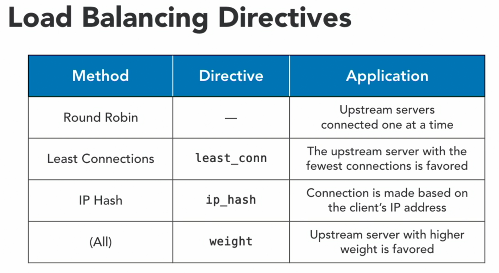

## - NGINX IN DEPTH (webserver, load balancer, reverse proxy, static-content, high performance, proxy)

    ## Config folders
    /etc/nginx
    /etc/nginx/conf.d
    /etc/nginx/sites-available
    /etc/nginx/sites-enabled
    ## Config file
    /etc/nginx/nginx.conf
    ## nginx Log:
    /var/log/nginx
    ## http-Root:
    /var/wwww/html

### + Setup Vagrant Ubuntu VM :

    $ vagrant init bento/ubuntu-16.04

    + Vagrant file :

    guest_ip = "192.168.0.3"

    Vagrant.configure("2") do |config|

        config.vm.box = "bento/ubuntu-16.04"
        config.vm.network "private_network", ip: guest_ip

        puts "---------------------------------------"
        puts "Demo URL : http://#{guest_ip}"
        puts "---------------------------------------"

    end

    $ vagrant up
    $ vagrant ssh

    #sudo su -
    #apt update
    #apt -y upgrade
    #apt install -y nginx
    #systemctl status nginx

    + Mean directories of nginx:
        -> /etc/nginx/sites-available # conf file
        -> /var/www/html # where there are websites pages content
        -> /var/log/nginx #log files


    + NGINX commands :
    - systemctl start nginx
    - systemctl stop nginx
    - systemctl is-active nginx
    - systemctl reload nginx
    - nginx -t # check configuration if it correct or not. before reloading it

    + Configuration For website `wisdompetmed.local.conf` :
    #default configuration
    - cd /etc/nginx/sites-enabled/
    - ls -ltr
        default -> /etc/nginx/sites-available/default

    ## Remove the default configuration
    unlink /etc/nginx/sites-enabled/default

    - vi /etc/nginx/conf.d/wisdompetmed.local.conf

        server {
            listen 80 default_server;
            server_name wisdompetmed.local www.wisdompetmed.local;
            index index.html index.htm index.php;
            root /var/www/wisdompetmed.local;
        }

    - nginx -t
    - systemctl reload nginx
    - mkdir /var/www/wisdompetmed.local
    - echo "hello world" > /var/www/wisdompetmed.local/index.html
    - systemctl status nginx

    - curl localhost

    # Copy files from Host to Vagrant Ubuntu
    $ vagrant plugin install vagrant-scp
    $ vagrant ssh-config
    $ scp -P 2202 -r static-website vagrant@127.0.0.1:./static-website
    $ password: vagrant
    #you should not be sudo user. else exit

    $ sudo apt install unzip
    $ ls /var/www/wisdompetmed.local
    $ unzip -o Wisdom_Pet_Medicine_responsive_website_LYNDA_12773.zip -d /var/www/wisdompetmed.local
    $ cd /var/www/wisdompetmed.local

    #secure files and folders make them readonly for world and write by root:
    $ sudo find /var/www/wisdompetmed.local -type f -exec chmod 644 {} \; # to secure the files
    $ sudo find /var/www/wisdompetmed.local -type d -exec chmod 755 {} \; # to secure the folders
    $ ls -ltr # check

    $ vi /etc/nginx/conf.d/wisdompetmed.local.conf

    #add
     server {
        [.....]

        location / {
            # First attempt to serve request as file, then
            # as directory, then fall back to displaying a 404.
            try_files $uri $uri/ =404;
        }

        location /image {
            # Allow the contents of the /image folder to be listed
            autoindex on;
        }

        error_page 404 /404.html;
        location = /404.html {
            internal;
        }

        error_page 500 502 503 504 /50x.html;
        location = /50x.html {
            internal;
        }

        location = /500 {
            # to test error 500 page
            fastcgi_pass unix:/this/will/fail;
        }

    }

    $ nginx -t
    $ systemctl reload nginx

    # now you can check the pages uri/images | uri/404 | uri/500

    #add logs files
    $ nginx -t
    $ systemctl reload nginx
    $ cd /var/log/nginx
    $ ls -ltr

    #requesting home page 10 times to valide logs
    $ for i in {1..10}; do curl localhost > /dev/null; done
    $ cat wisdompetmed.local.access.log

    $ for i in {1..10}; do curl localhost/images/ > /dev/null; done
    $ cat wisdompetmed.local.images.access.log

### - Troubleshooting nginx
    $ nginx -t # check config files are correct.
    $ sudo lsof -P -n -i :80 -i :443 | grep LISTEN # check port 80 for http and 443 for https are open.
    $ sudo netstat -plan | grep nginx # check processes that are listening.


### - NGINX WebserverSecurity :

    # best practices
    1- keep your OS and Software up-to-date to protect yourself from old vulnerabilities.
    2- restrict access where possible.
    3- use passwords to protect sensitive informations.
    4- use SSL to protect transmissions and identify your site.

    # limit access
    $ vi /etc/nginx/conf.d/wisdompetmed.local.conf
        location /images/ {
            deny all;
        }

    $ nginx -t
    $ systemctl reload nginx

    # you won't get the page.

    # update restricction

    location /images/ {
        allow 192.168.0.0/24;
        allow 10.0.0.0/8;
        deny all;
    }

    $ nginx -t
    $ systemctl reload nginx

    $ vagrant destroy name

### - Establish Authentification to access home page:

    ### Install apache-utils
    $ apt-get install -y apache2-utils

    ### Create a password file outside of root directory for securing locations

    $ htpasswd -b -c /etc/nginx/passwords admin #  -b -c for creating file
    $ chown www-data /etc/nginx/passwords # only be read by root and nginx user
    $ chmod 600 /etc/nginx/passwords

    $ ls -ltr /etc/nginx/passwords # check if permissions has been applied

    # if you want to change password of a user
    $ htpasswd -b -c /etc/nginx/passwords admin
    - deleting password
    - new password

    # add auth in the sectionyou want -> / or /images ..etc

    $ vi /etc/nginx/conf.d/wisdompetmed.local.conf

        location /images/ {
            # Allow the contents of the /image folder to be listed
            autoindex on;
            auth_basic "Authentication is required...";
            auth_basic_user_file /etc/nginx/passwords; # outside http-root for security reasons
            access_log /var/log/nginx/wisdompetmed.local.images.access.log;
            error_log /var/log/nginx/wisdompetmed.local.images.error.log;
            allow 192.168.0.0/24;
            allow 10.0.0.0/8;
            deny all;
        }

    $ nginx -t
    $ systemctl reload nginx


### - Configure HTTPS :

    # SSL vs TLS
    + SSL can be reversed and it's deprecated.
    + TLS is used for encrypting web traffic.

    $ apt install openssl
    $ openssl req -batch -x509 -nodes -days 365 -newkey rsa:2048 -keyout /etc/ssl/private/nginx.key -out /etc/ssl/certs/nginx.crt

    # req "request to openssl"
    # -batch "remove the prompts altogether"
    # -x509 "generete a x509 certificate"
    # -nodes "not use DES encryption method"
    # -days 365 "lenth of time this certificate is valid"
    #-newkey "to generate a new key"
    # rsa:2048 "use RSA encryption method 2048-bit key"
    # -keyout "path to store the key"
    # -out "path to the certificate tha openssl wil generate"

    $ ls -ltr /etc/ssl/certs/nginx.crt #check certificat

    $ nginx -t
    $ systemctl reload nginx

### - Reverse Proxy & Load balancer :

    + Reverse proxy
    - middle man between client and server
    - could handle just one server
    - help implementing SSL, Logs, for web applications
    - compress data so that reduce latency of response.
    - cache data so it can reduce request to a server each time.

    + load balancer :
    - could do all reverse proxy functionnalities but with many servers.

    # Setup a Reverse Proxy

    $ unlink /etc/nginx/sites-enabled/default
    $ vim /etc/nginx/conf.d/upstream.conf

    $ nginx -t
    $ systemctl reload nginx



    # Setup a Loadbalancer

    # RUN THESE COMMANDS ON YOUR LOCAL WORKSTATION
    # Start the virtual machine and log in
    vagrant up
    vagrant ssh

    # Nginx is installed for you in this lesson.
    # Proceed with the following steps to complete the configuration.

    # RUN THESE COMMANDS ON THE VIRTUAL MACHINE
    sudo su -

    # Remove the default configuration
    unlink /etc/nginx/sites-enabled/default

    # Create a the new configuration
    vim /etc/nginx/conf.d/upstream.conf

    # Add the following contents to /etc/nginx/conf.d/upstream.conf:
    upstream app_server_7001 {
        server 127.0.0.1:7001;
    }

    upstream roundrobin {
        # default is round robin
        server 127.0.0.1:7001;
        server 127.0.0.1:7002;
        server 127.0.0.1:7003;
    }

    upstream leastconn {
        # The server with the fewest connections will get traffic
        least_conn;
        server 127.0.0.1:7001;
        server 127.0.0.1:7002;
        server 127.0.0.1:7003;
    }

    upstream iphash {
        # Connections will stick to the same server
        ip_hash;
        server 127.0.0.1:7001;
        server 127.0.0.1:7002;
        server 127.0.0.1:7003;
    }

    upstream weighted {
        # More connections will be sent to the weighted server
        server 127.0.0.1:7001 weight=2;
        server 127.0.0.1:7002;
        server 127.0.0.1:7003;
    }

    server {
        listen 80;

        location /proxy {
            # Trailing slash is key!
            proxy_pass http://app_server_7001/;
        }

        location /roundrobin {
            proxy_pass http://roundrobin/;
        }

        location /leastconn {
            proxy_pass http://leastconn/;
        }

        location /iphash {
            proxy_pass http://iphash/;
        }

        location /weighted {
            proxy_pass http://weighted/;
        }
    }

    # Test and reload the configuration
        nginx -t
        systemctl reload nginx

    ## Test and reload the configuration
    nginx -t
    systemctl reload nginx

    ## cat start_app_servers.py
    ```
    #!/usr/bin/env python3
    '''Module: Starts three HTTP servers'''
    import os
    import time
    from http.server import BaseHTTPRequestHandler, HTTPServer
    from pprint import pprint

    hostName = "localhost"

    class MyServer(BaseHTTPRequestHandler):
        def do_GET(self):
            #print(self.server)
            #print(self.headers)
            self.send_response(200)
            self.send_header("Content-type", "text/html")
            self.end_headers()
            self.wfile.write(bytes("""
            <!DOCTYPE html>
            <html>
                <head>
                    <style> h1 {
                                font-size:100px;
                                text-align:center;
                                margin-left:auto;
                                margin-right:auto
                               }
                            p {
                                font-size:20px;
                                text-align:center;
                              }
                    </style>
                    <title>%s</title>
                </head>
            <body>""" % self.headers['Host'] , "utf-8"))
            self.wfile.write(bytes("<h1>{}</h1>".format(self.request.getsockname()[1]), "utf-8"))
            self.wfile.write(bytes("<h1>{}</h1>".format(time.strftime('%X')), "utf-8"))
            self.wfile.write(bytes("</body></html>", "utf-8"))

    def start_server(port):
        this_server = HTTPServer((hostName, port), MyServer)
        print(time.strftime('%X'), "App server started - http://%s:%s" % (hostName, port))

        try:
            this_server.serve_forever()
        except KeyboardInterrupt:
            pass

        this_server.server_close()
        print(time.strftime('%X'), "App server stopped - http://%s:%s" % (hostName, port))

    # list of the ports the servers will listen on
    PORTS = [7001, 7002, 7003]

    # list to hold the PIDs from the forked servers
    SERVERS = []

    # start a fork for each port
    for port in PORTS:
        pid = os.fork()

        if pid:
            SERVERS.append(pid)
        else:
            start_server(port)
            exit(0)

    # wait for the servers to finish, bailing out on CTRL+C
    for server in SERVERS:
        try:
            os.waitpid(server, 0)
        except KeyboardInterrupt:
            exit(0)

    ```
    ## Start the app servers
    /usr/bin/python3  start_app_servers.py &

    ## Open each proxy location in a browser:
        http://192.168.0.3/roundrobin
        http://192.168.0.3/leastconn
        http://192.168.0.3/iphash
        http://192.168.0.3/weighted

    # troubleshooting problem - Address already in use:
    $ ps -fA | grep python
    $ kill 81651

### - Improve performance
    + Enable HTTP/2

    HTTP/2 allows browsers to request files in parallel, greatly improving the speed of delivery.
    You’ll need HTTPS enabled. Edit your browser configuration file, adding http2 to the listen directive,
    then restart NGINX:
        server {
           listen 443 http2 default_server;
           listen [::]:443 http2 default_server;
           #... all other content
        }

    + Enable gzip compression

    gzip compression can greatly decrease the size of files during transmission (sometimes by over 80%).
    Add the following to your server block:
        server {
           #...previous content
           gzip on;
           gzip_types application/javascript image/* text/css;
           gunzip on;
        }

    This will ensure that javascript files, images, and CSS files are always compressed.

    Warning:
    A security vulnerability exists when you enable gzip compression in conjunction with HTTPS that allows
    attackers to decrypt data. For static websites that don’t serve users sensitive data, this is less of an issue,
    but for any site serving sensitive information you should disable compression for those resources.

    + Enable client-side caching
    Some files don’t ever change, or change rarely, so there’s no need to have users re-download the latest version.
    You can set cache control headers to provide hints to browsers to let them know what files they shouldn’t request again.

        server {
           #...after the location / block
           location ~* \.(jpg|jpeg|png|gif|ico)$ {
               expires 30d;
            }
            location ~* \.(css|js)$ {
               expires 7d;
            }
        }

    Examine how frequently your various file types change, and then set them to expire at appropriate times.
    If .css and .js files change regularly, you should set the expiration to be shorter. If image files like .jpg never
    change, you can set them to expire months from now.

    + Dynamically route subdomains to folders
    If you have subdomains, chances are you don’t want to have to route every subdomain to the right folder.
    It’s a maintenance pain. Instead, create a wildcard server block for it, routing to the folder that matches the name:

        server {
               server_name ~^(www\.)(?<subdomain>.+).jgefroh.com$ ;
               root /var/www/jgefroh.com/$subdomain;
        }
        server {
                server_name ~^(?<subdomain>.+).jgefroh.com$ ;
                root /var/www/jgefroh.com/$subdomain;
        }

    Restart nginx, and you’ll automatically route subdomains to the same-named subfolder.
